

# TypeScript Awesome Template Literal Types

Curated list of awesome [Template Literal Types](https://devblogs.microsoft.com/typescript/announcing-typescript-4-1-beta/#template-literal-types) examples.

## Handbook

- [Template Literal Types](https://www.typescriptlang.org/docs/handbook/2/template-literal-types.html)

## Articles

- [I need to learn about TypeScript Template Literal Types](https://dev.to/phenomnominal/i-need-to-learn-about-typescript-template-literal-types-51po)
- [TypeScript: Template Literal Types](https://michalzalecki.com/typescript-template-literal-types/)
- [Exploring Template Literal Types in TypeScript 4.1](https://davidtimms.github.io/programming-languages/typescript/2020/11/20/exploring-template-literal-types-in-typescript-4.1.html)
- [TypeScript Splits the Atom!](https://effectivetypescript.com/2020/11/05/template-literal-types/)
- [Mastering TypeScript Template Literal Types](https://betterprogramming.pub/mastering-typescript-template-literal-types-f4131a94ffb1)

## Videos

- [It's Clash of Code but with TypeScript only](https://www.youtube.com/watch?v=_3vIxQyfi8E) by [William Candillon](https://github.com/wcandillon)
- [It's Brainf**k , but types only](https://www.youtube.com/watch?v=DUjRBaJM01E) by [William Candillon](https://github.com/wcandillon)

## Examples

- [dot notation string type-safe](#dot-notation-string-type-safe)
- [document.querySelector](#documentqueryselector)
- [Router params parsing](#router-params-parsing)
- [static-path library](#static-path-library)
- [Expression parser](#expression-parser)
- [JSON Parser](#json-parser)
- [JSON Serializer](#json-serializer)
- [GraphQL Typed AST](#graphql-typed-ast)
- [SQL Database](#sql-database)
- [CSS Parser](#css-parser)
- [ELIZA Bot](#eliza-bot)
- [Typescript Type System Adventure - by Rick Love](#typescript-type-system-adventure---by-rick-love)
- [Printf/Log](#printflog)
- [Bitwise Arithmetic](#bitwise-arithmetic)
- [tRPC](#trpc)
- [Split](#split)
- [Privatized](#privatized)
- [Join](#join)
- [Extract all paths from object](#extract-all-paths-from-object)
- [Repeat](#repeat)
- [Schummar-translate](#schummar-translate)
- [kysely](#kysely)
- [chicane](#chicane)
- [prefix-properties](#prefix-properties)
- [typelevel-parser](#typelevel-parser)
- [type-trident](#type-trident)
- [hypescript](#hypescript)
- [anysort](#anysort)

## Use Cases

### dot notation string type-safe

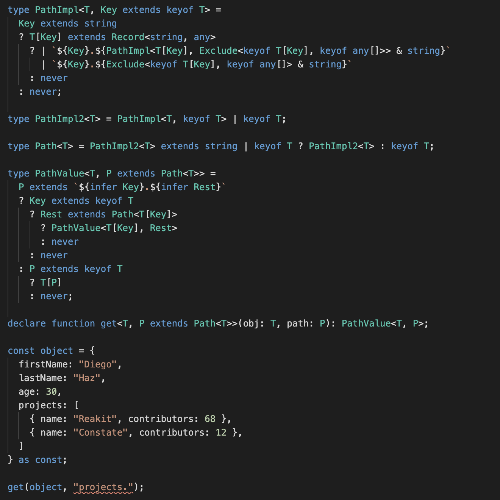

[Tweet](https://twitter.com/diegohaz/status/1309489079378219009)

[Example](https://www.typescriptlang.org/play#code/FAFwngDgpgBACgQxACwJIFsIBsA8AVAGhgGkowYoAPEKAOwBMBnGAazIHsAzGPAPhgC8wGCTIVqdJjEYgATgEtaAc2EwA-DwDapMAF1xNBswBKUAMbtZ9HDIXKiCWmF6qRGgD4wABgBIA3joAvgB0-ogoGNj42mS6RACilGZYAK70UDhsYFxaOnGsHNyOYJq6vPwAZNJyikqBXq4iMJ6+AWQh-onJaRlZOXgxekR9RU6lldV2dQ1NMABcMLRQAG5QsqoLS6uyANzAoJCw4WiYWABM+PwC8EgnUYQF2dx8zY-9ewfQNyiXgt9351+VEMUlstVeIx46n+kUBLwWkLwH3AX2OADUEKkMg84AZJMxjpcrqpccD8d5-IpOGtRGAOn4qTTTDJ6qoNDo8UY3s9GhpmSBOVJCQM8i5Zm5-hisdE8kR+WLxZsVmtGkrtht4ILmIjeVo4LpVYtlbt9ulkghZLBOClaGYQPJ2LQYEooCB8ERSRIucLygAKdgAIwAVgsHhBbgs4ABKSO3KUpbEe3gfCy0GQwQNB8wC65+VSceSyGQAOQQ6CgCwARAAReRQJTsSsEVRYBAlssVmCVgASCAAXk3VAgXQsAMwABmbIggsnYWbtjAWmkafkWHarpgQLHkICbMFTNQDKRAlkXMAAbAAOGCBKdNVe0dddgDCjpkSCge4PCiPJ6LCwARjOG87wNQIYDbfc3xAD4XRAf1g2zIhKxnOds0YYJKyjHYgA)

### document.querySelector

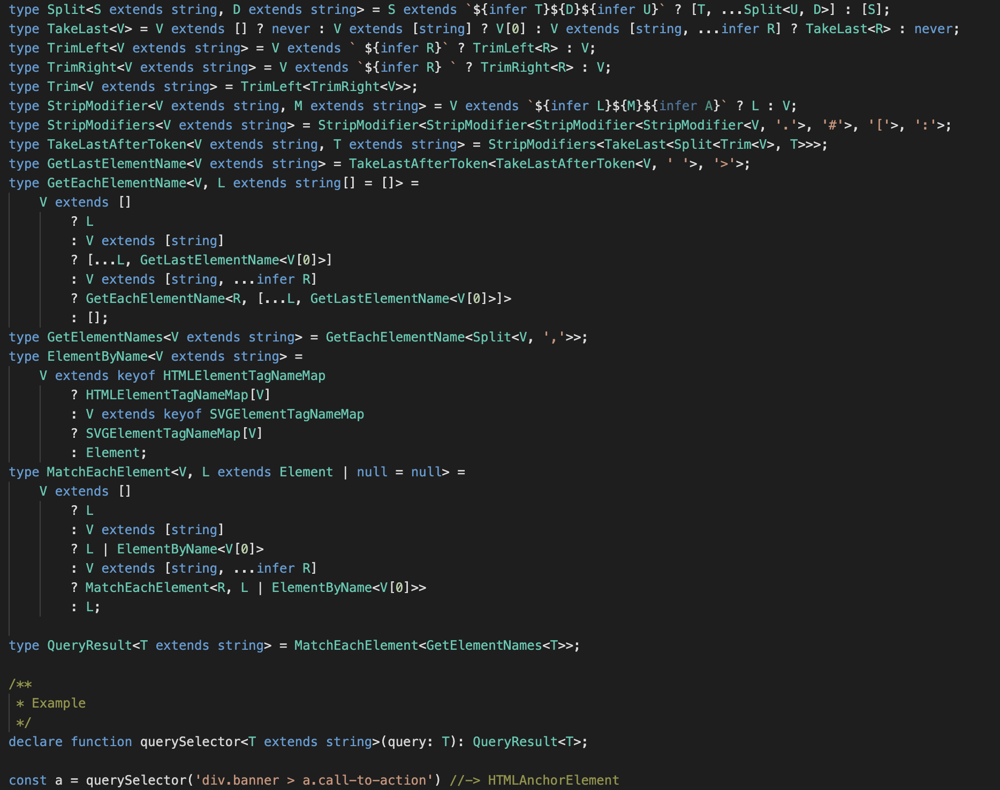

[Tweet](https://twitter.com/MikeRyanDev/status/1308472279010025477)

[Example](https://www.typescriptlang.org/play#code/C4TwDgpgBAymA2BLYAeGUIA9gQHYBMBnKQ4AJ0VwHMAaKAEQ2zyJPMqoD4oBeWJnAWIADACQBvSgDMIZKABUAvhPrLJuGXICqi4VAD8UANry6AOgtwkqLXXqcAulABcxmA4DcAKFCQFAQwBrCAAZf1IUADVuPkiBFmIjJ0NcCAA3WRcoOKxBViNSCmpk7KMABidXHOYhY0KOcwtpTIAlEvkg0PDUFu5XVIyyb19oeQoAWxCIKVRqvOJ66hjs+Nq9CWa5Ft0DBQmpmZRerMjh8FGJlsQqAAtZ1dZFrl4V3ISoMXVNKG2P3bHEOMrrcen1smc-ADxlEHgt2EsXlCDqgocC7lFOJwIdAYOwwABZAD2+EQUkQshhb1qTzo+NhbCKz1i9M+mygITU+LUbIAgjtDCETtjYHiiSSybJCJSao94UyRRQCcTSeSyGhRcqJWrcYqxSqKTrEErxaqonQAORmc2cC0AYmtFqMDqg5uc1uFHWCYVIPJmsnkhOCuGl8wZDQU9Key0Nxv1ZClnq6ESsyBQUIxdHkmKxPnOUAA4hBgN7gABReAQcZ4YAAOX8VZD7yjiM6Jd9ODIAaDadb3Xb-sDeDNLpdNtH7tzfkLZf8AGMbuXK9W6w3InRBVTZYyki8kssvFBD68ZYknAejxeBVBzxfD1V6QU5Wfb0fDEYLGYQnRpyXF1XcLW9YQFE5QOI414vnex6ho+jKNGYbJtBBkGGNOpZzguFb-oBDYtHQ74WF+BZFr+WHLkBIEVI43A3rerhJMKaFkQBK4QFKcxNnKyxoRhf7kQ2KazBaNDWjmIxQHxAEAEIgKxjbUlxLy0RxtTBCAhJSFAAAS8j4iEknAB0VCsfi-hgMhL6GDpekGUZJlmUYkTPpB96bsQakabAkT5rZ-jGUBpnmbRl5eT5zGGX59lgI5zkvq4BnCqZwDzuhKXhcOG4nhJ4VQAAPlAuAAK7wPALxFSV+4Xip+SxbeV7BUerlZbBHC1SFgr5QZMlyZEoE0ZBJwPjSUAfohbWvlASUpbx6V4eyeXZUu0myRRvVUf1Lnst4k7QAAioVsggC0bHFSikaKXwU0LjNS2oExt2sQmmLbQA9AAVG9B5vRJmD1ggEBfS9Xj4BAs7wP4ZDQFIhW4LOwCIISuBQAAjgdZAgDAEAVnDhJqvI52MpwAAUqOHa48gAJSuPth3HYQp1pjmXizojpBQP4Lyk+jmPY8AuNE+aJJpGYABG-i4KkcjcP4Zizv4JUALR8wrc7w4j5oU1AL0vQr3DWSEPKwzcuMGczrPAFAIuc2jGNY6DfNkALlBgIVwB0ELGtazreu6SEACSuAu2WOX5fr9CIGkpss7gbOztbh08-b-PmrOiBkGDEBGLOmA8AARAAjAArGUucOJ72u66FADCacZ1H5tQPg8fc3bOOO+aIuu3zuC2p3IAK7ghIAO7l972m+1JXeI-XMcW9AfBc7bvPJ4Q9sI0jYDOGS8bAArGlK+cGseF7lf6wAChDflkGZmG3V4QA)

### Router params parsing

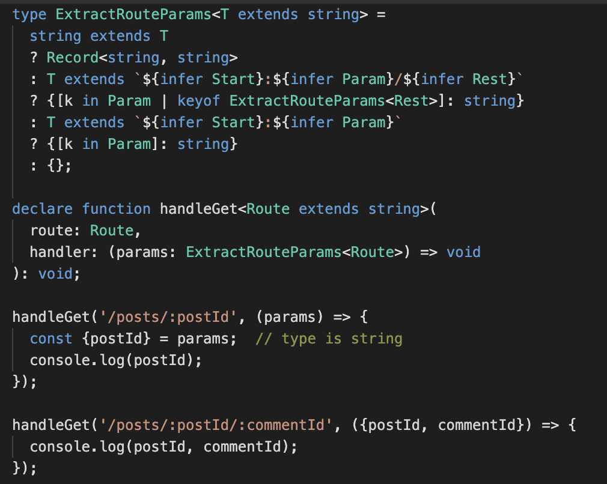

[Tweet](https://twitter.com/danvdk/status/1301707026507198464)

[Example](https://www.typescriptlang.org/play#code/C4TwDgpgBAogHsATgQwMbAEoHsCuwIAKyKAtgM4A8AKlBAhAHYAmZUZSAlgwOYB8UAXgBQUNpx616zVlRFQA-FAwRUWREwrtEXbgBox2nrzkAuKDTr5pUAAYASAN5cAZhERQAysGLAAviccXNygiUl8AekCGV3dldl8bOUUHAG0AayguEOJkEigAHyg0iBAsZ1gEFHRsPEIc8go44F4AXTMtHV9Tc0krFlsomM9vRD8Ap2jg0NyEpKhUjKzpkjaDTu6HXwBuISEmFQAbYmhnHAZ0DiwGKAALZGYDiABxCGBG3Hxexn6OowAKOSID4QMw1fC6OR3B5uMx-MD1MhmeBINCYYHLShgiC8ACUgn4ADcsBwmEIcWYiSSdkIoUxHi9gH8AOThMBYdhkcImNnsACSTCZ+jhCLxAn4DjkqgY7HmPOA-N8gig8NIZC2onC4SgoEgmVYv24kquZCwjwAdAcsNw4ez5UwcTtfA7drT6a9mazbZzubb+VzVCQSIw7YKoH8HHL+foA0GGHanfj5kbpaaIBarTa+Uxo1hA8H+c6ndShI9gFAgbUlQAicI4MhuLl1tz8qsu+5057uivgsMOKA4BNipNCJ1AA)

### static-path library

[Tweet](https://twitter.com/garybernhardt/status/1466104868498817032)

[static-path repo](https://github.com/garybernhardt/static-path)

[Video walkthrough](https://www.youtube.com/watch?v=KRMJIiGE0ds)

### Expression parser

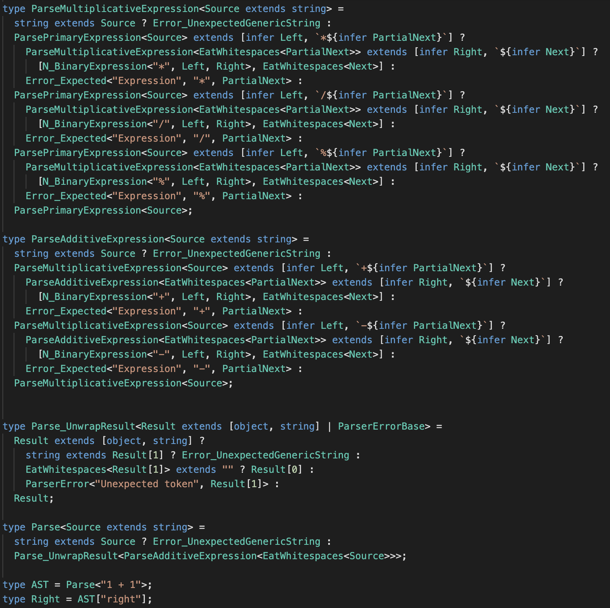

[Tweet](https://twitter.com/NicoloRibaudo/status/1304515347932999680)

[Example](https://www.typescriptlang.org/play#code/PQKhFgCgAIWhlAwgJQPIBl3QCqpwCQFFoAhVbXAWQEIpZo64BeF1t9jzr7lxhmONgAWASwDO0AO4iANjOgAjAKbQArgDsAtgEMR6gC6712hTKUAaaGID20fUKUAnFdudXrmlY9VmJASWh1JSUAEztbADNrOWtJADo+PgBVfVkAfTh9AE8AByUJVxV1a30rPIBjEQiRcvDoAEF4bDFLBVVSwugAcyUgxxqceDVUmRFU-ISBaAA5DLtc-OhO4pCVCO1y-Wt+icSpwgA3JyzoAAVXMSU4JQAPCv0JMcf1HPbAkrry6wMjJfUTszaEJ6LpSUT6fI5Da7KZ8c6OS6ZBYSJRjByOaDOfSqRzqJZnC5KQiORzbAA8lHyYm0PQAfNBtvjsTkzNAANrTayrSzTW76eDWHHlJQAXUmsGAUCg2TyBIRTmJpMcJG0l2gTGgAG9oE4lQAuOzeFQAXwA3NKFnLLo5FeTKWJqT0dTcIeoQhIxPp+uoupYBUKVHzeu6rF6QerQ96uvSNfbHSoAGTQFLpABiMm0+mwCzJ8OttuVqsTWvcAYN-scwugxtp5sgMpUBbSSXUzg2QhMrI1eYVJPJACJ6g6nKlvgaW23yh3TCoG-3axbZU2W7d7qEAOK9Jw1eBhn0Rns2vuOMn9ld3JSbULdLf9WqeqPzPLzusN6BNwgXq8hMkAdQ7pRBm6Hp7r60D-k4gYusGIFRn6gqVlBrohg+IIxlavZKmSAAGn5rmEADkAAkmr-pmxoEUsEQQhixGkeiSgUdh8EBgukCLioKYyGk6aZtmeRktg6HYM6yESNYCgAFaXqUAD8JZsgA0tAejQAA1koWTWBEOAiuOIw8RmWY5tgSkivSxrQAa2BSvWlqNNgnKrIJlpAShoGWKcpI5GI6FcYZfE5tqDbWZallJl51g+Wxb6zNMqieHe6BjE42gyGSABqaWqEhMGRmhEYOU5SinvFiU1MlNFpf2ljagc2VKAaWUyDl1YxZaswkHorhZHhzgOiI3xkqgOSiXlqE+pY6BKNRljICIXRCPo6FFVyJX9l1xiOL1dz9WIg3qDVJZRalboGiNlhmNRBrTbNmILUtBrzYtpQ1nWHHvpm-4pWIULCmIZIVlWbmwQVTB0Pl+4gwgCFVvJh4Fqe574TefQDBNoJzvSeoQ0DuXAdA2HQCRegRE4Mx8saRPyYQX3gpC0IA7yLrY7jsNKO9dmyog3ypOoOVksg+Q+PoPJ8mNBMY+hbJC2IIuWLT+jfRCv2M2SzPLSKnNvj2ZXKI4aR6DRxjpfCqRpRL7lwTDAaW6DPoxhDGN2zbiHQDTx7NkEX4QiEm5o+Uu6PjjMCu8D0EE9hAAMJPqGTGIa1T7sYXrTiGwYTgmzhJFmyIaXGlHzEUyzVls7b0PYQAjLH8fF-oSfw4SqcG0bmdpdnmq5-nldFxrrOh3jLvYQATDX5OJ9TKcJfr6fG+32E5645syMaw+93y-fQGH+MhthADMY8J5Tk+69Paet7i8+L44y-Gnv68lyHW+DxXAAsh91w3U+aDPF9Zwvncl55xXq-B+y1S4D3ZkPAArB-CeydT4-3PhnS+6UAFdxXtAsBm9t5DwAGxwOPggpuZ8W4oP-tfW+eDsEQOflAiuAB2QhLov6IN-uQq+gCb7AONAwmhT9cEVwABzMPrifEhSCyFzzQZQnhQj+FlzdhXAAnKI1hEj2HSI7hg40yiFGhzZBgliiEta2R1hopwgN6ERytmDJ2oEXaDw9kqL2q4ZIblvDuBxAi2HIK0f2I6eN6TQzZAE4xwoRTEPlEeLC-Y-DqHqqMMI-NJGBPZjg3xUi27pTCdvYJNiJBsgAaTcepCqaWGKXHcex9InyQ5GkMq25yiVVSulZutIFZ0x+n9fI6sN6RIEcuVsSh2ydg5mYy0PYvIiB0NtPqVIDppChM4AwDh9oAC9QhWPLgUyG0Z1T2MfNDJx75PbI3cX7TxgdvEQymf0WZO0ch7UWcs3o9h8giE2SENIXwDB6AFj2eoIRgSpCOPMgaQ0glsQ+ncmZPVwX7W+EswoqyPlfJ+bzf5JVZYixdmyCS0lNiWAxpEgAPhhGJ2wVSXEdqHHFMhAK7PxVJGSxLQK1IhlvZ20N6X6DZJXWppyXHnO-P7JpQdwwCK3ry-lkSK4AEo1GTxlsLBlbIo4ik6Uremqt-p9JZgMzlQrthpDwhc088qjr9nhG8tZnzQgIoOkdGVAqcG8u1pMwk0yHmOshdYsSezaVcocccqBziTUit9mKu8Er9wCJfrs7CAAKJVUTLjevhbtBZSLXmoo2VsxWysGZ6r7hkixJ4gkTNlD2SgIsRAshqJmEQYKs0QvUNspRuypYHNDty3ZJyhluNFVc2NoIfFevuZmp52b21BLxSUjEt1RaExAB-DBE8OWhy3jWutDbyhNpbdOttZJC06p6QDddG98kBrZAu6Az0loVKVZurer72SdW6nM1tiL239hAEdJdc0HrLS1UW3VvS+6Gq3cag2Zrvynl9YdSwf6jqXsfrcidcKv1Hp-R24U168q3qqYumay7sLADXUAtKG73ZGp3Qy+tox92gqJN+g6J6ukq3PbmKjMhS3zuI-e4DT7NR3po7JI1W96mbSnc8oa-ZgAAdI0Bl6HTPrau6WrSDtDX0fh9ls-siGrWKc8rxvuOnYU+rY361iAna6AcJgAUko9w6jNTaPQfo6kPdB7WM4fY6ezTeq0PLQIwTIjtcH1kefR5t9UmP1bUeXJ39jmlN3Si2pwLXGtP9J01vPT+EEPWaQ9AfsqXTOub4xvCzmGrP+Zs4haFXMVCAuBWMZtfnkt4Z3vbfZ4Ne0hv7WGmDrj9OXIDqOmr8pa0MZ8yxxD3Wwshgi+TBz2EADULnl7ibo4SIFIKOsLay8W3pIXaRLcKXeqLImxPuYk9B+LaQZPYa6-2dbaXl0ZdA2enLBq8sjbg77Ir9WStvdQ2Z6r47pu7qY75hbc6Ql3rWwAWi28Anbnm9ttfm8VjjGnsvBYhyzC77IrvCcJjF+7cX31Pc-Ulmdp5kcfZU0tTLnGTtM1y1KgHY3gfJatUzir23IcYeh7N2HOOQeLc5jCwkXtJCOG0DkXlgtVWMpvQS1leyyUUoLNSpQQb71q7xZrol2vYuvr7QGl1grB1jejV44ORrjvgYBjbknATk4yo1f9hGx4kbexRlsDSJX3c6fdVWlrhJusu27f14NRyhu23DQbSNHiJs3NDj2eXivldq54-Kfb7XD1dZd9xqFTW3wOQPNH-sldoDregJXF8H0ouFSaKE-oL1+ymMgEAA)

### JSON Parser

[Tweet](https://twitter.com/buildsghost/status/1301976526603206657)

[GitHub](https://github.com/jamiebuilds/json-parser-in-typescript-very-bad-idea-please-dont-use)

### JSON Serializer

[Tweet](https://twitter.com/RReverser/status/1332088256826142722)

[Gist](https://gist.github.com/RReverser/ad3bef657aa32a15ca9e55386feb8fb6)

### GraphQL Typed AST

[Tweet](https://twitter.com/dotansimha/status/1302294238139473923)

[GitHub](https://github.com/dotansimha/graphql-typed-ast)

### SQL Database

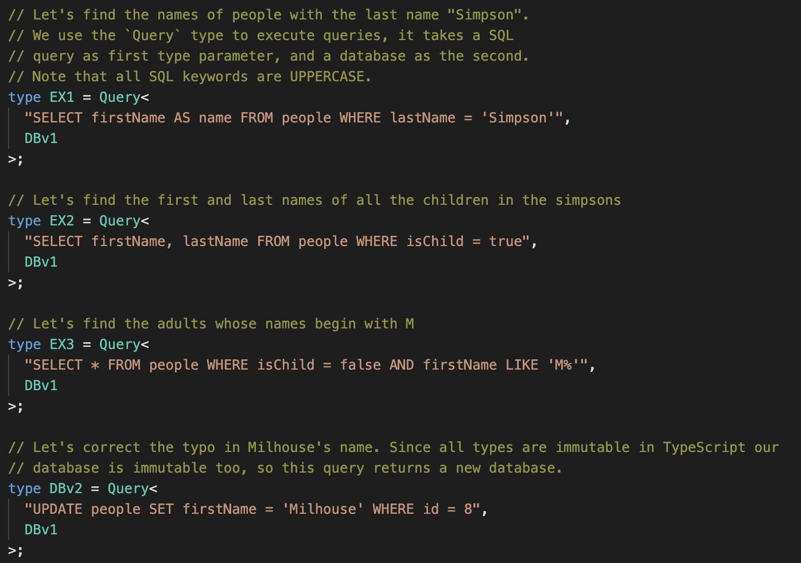

[Tweet](https://twitter.com/c_pick/status/1307433762914009090)

[Example](https://www.typescriptlang.org/play#code/PQKhCgAIUgDeo0oENJVvcyKMa3-B2OaWx6pikgCaSCJpHfQzYDGktjjThnrb9LPDfJpUiAA0jEjAEaQ0J4kdWmzFnLgsXj5MtVMHD8tDnubLjhfSbOnm+3Xgu3pZTETIbH8gwX3Xolj1m78fPx0QcGCKjo+nkYEauLaonHqiXHatBLEacw2-jEm9n75yl7BId5IhoXOGAlF1egJWqquZDnu0aVVKp3FMQE8QlGxnEnJdaNiJnJ4EyKU8LCUlAAqABYAlgDOkFuQAIaQAMoAigAykAAmewAuewBGe5sApjsAtgAOADZPr08AdtcnhdIO8AK4AJyenwAnjs-pBltD3k9DgBjcHrd7XSDXJEvPZ-P4Ae1u13WRL+mwAdCsNttfgTttdVjcdtiicjwTcnttNkTvjDIBScXjtgBaSDQomgy5PABm6z++MgACIrrcHs8VQAaSgACgAVqDNtiDrjkftCSSbuS-gBKS3A5n-SAAR1BT3BsPW2ONioA5pA+b9IK8iZCRRaCcTSbbqZQAJLYzag97vcPXbYHFN3Z7suVHM7auGoz6gi4Bo4AUVOVYAwstIHqAO4+1aQVEUitkinbABkkANRMVmztup8CYAcocqwAlZbFgCqAAUACIAQWWVcdkFXNarW6DpJ+-0zNJ8tN273BRINT1R2M+6wAbjz9tjVtdru9NgAuYDAP6bagncVKdq8wCdhcPzrAAHsAmZipsrqfJQPqQM2jwYRiX4uncsJ1iy4LfNsy7rKiADWTYdkRJEAAJQTBsFgUSrzFp+35-gB1ytrh4IsRBqIAPrvORVF2ueMCUAAmtKHYEnCJp7J8nw4psSEoXCkrSuCQrNvC163ve2K8e2sB-O8ryKbcKmQAxRLQa8cEIepyGfLAQrgvM0J7OC8IjjZqn2Y5zmIW5Hl6oiyJohiWKQAALFSACMOzbJC7rrJCFwSUsPiRZiv6QKsRKvrpJWejiqwvOa+JPo8b53FCRLNjiRJBk81VVZAkIpp8mZCgWUoQm6HoYjydq5SAwDgDNAGQAAxJAi6bHs-pPLNwCQAAYplJoYS80EKkqlUHTcZosiZTwAOQRv6w5-IG1xtY1I2etClarXsAU0p2lLJusHx8pSkAALyQAA3lAIJPBy3yFQA2lDWDgzsFyFUlxYKuCJqTnsvyFSqABCvnXDqkCfI81y4-jqqHADP4UmTWyEesnxozi4IepAAC+454Cj6zswATJju1U3jTwE6cWx7GTFM4xLBN04DjPFszGxs4V1ycy8vNIxDqOFQAzKL2PizTKoALKrUBTxy5T1OS7T9NA0zmws5rHNc3r+AC+z8WmwrFvW+Ca320HTsqsrDN-G7Hvs3KynPDzfPI4bkAAKyB+bkcABKsZ64c50rLuq6l8eFYnnzJz7-PpwAbNnjsE5bFLXHdvxekXzeqoTEKUnHGsJ0nuupwbguFQA7E3iuqgA6lVFOx8W8vF7TTnOtjg+s8P1ej-rfuFQAHDPFuTqznzFcadsrw7s8qgAagp+egoCy-l0PWs6ynB-pwAnKfSOk4oSu1vhHFuoIAQAC9t6e21t7Meh9IBJQAAyAIJsuDEfxUSYmUt3e+hwKKKiVOCWBu8a58wALp8y+HsVEPIEa-z+AQ68AYFRQmBFWb4vwAS+WhGTZqJCEzs1QWrTY64HwvidvA-evtIDMLPqCUsTxfKQGXM1Cqy4l6k2LIIz0wjCqN1ShIskr4v4IKYffKspV-SQhdMsT0XJ6ECP0vo-2YiTFSPMbIuuCjI6t2JFyVmLihHsxPsYyRZjIBVwoZYi2yw7FX2TkSAs+dwQ3lIbo1x4IDHII8ZE6R39a5pz8Rgim0JbHSj+BcEJbjCoAIiaYwpFisDUPANzfY2xfomgANwbQRHSVKJ04Q+nWMpSApVNi2gGkKYa6p7j1RpDVXchNnwpTBjVFJQZS6Uj6eAOapwnjXCutsI6Toup+O2Fs5EsMXimWGaveREtnYq1jjSOac8XjX2GbAY4o1oQeWWU9SATxYL3lfi8d0np1g8jVtiW4FE3wHBOKcfZm0oVek6dEsWkYXjvF8hLQE4JiwEmBAceZmp8RMi6s8X6Fx3mbUnCSTqrJlKqRRZARF0JmzhguFmCMK5lxzjrOuGcSy8SQCrAADXWZAP5b0AA8UMo77gbNis2jtICiqeSGLas4ADyltoa3MgHPXOc5tyr01WDK60cgZXR1FDVcqykrgAAHx7IOUck52LqnDKxntUl5NKY6rfFstlwzURD0hP5eEzptmvM2OAZZ0qhagzlf8pVWAVW1jVQGnOYCc7bQNUam5XwXhmotR-He6aZGOqwM6tZ7rPWbUOcc05ipzn4guKCPq2xmzFWTpcyAjUgLwnuZbZNErpVG3TfKr0WbaaqsbDAPVhrjXltNea2c251Y1rBjEl465JyrnVRHSApwEwAGltxXUtgAUgdXzRtrqPX9LbT6zs6TjLDPNG1RUkBLasySddbYfiqRHEVPQ-Ytkar8peADV4r97jfC0lFFE6JMTsghGiy4Z1KVDMQ8hu4qGnpEmLHySquwMWwkhNcfuWZ5FPBahSxZU6LSNrTWDed0JF0qhXBuQ8ZbUMzkbPm61kA73AelM8K6W6q2C3TUfetKym1vtwx+rpVVKKVVZDpSAqZ1R3PDIii4M0U1SvinOzNOb6wruLeu4TFbt27uBGDZTxZOPqa9e2-YFwyVMZalGglD5PQkv9F9ONgy6MMf2IFvDGo2PLMbbO7jmblVThnPOSAU5lj6o3SJg8qN01JQxmeotNqElEmhFdQtEm72ojrGWSEtXq1s3TYelTnHm3menVKjO1nFW2bVauktBXnNVvE88yrN4atkxS95zai4-hygzJA7kMJizNheEqIErVZTfEBAiWbgHGvNfWsl1ZVm0uKuVXuWsh412lphpuytO7yv1aqzVrVJ7g3nptZbM7EJrpddWUbHr7GXjSvroNhdyqZy5rE2LTVT3xvyfe3u9rB6R6g+fPFCHHyXiogUnsfzgGiSdSJL1jjqyBs3bh9mzLc5Gy5fy056sjZFNg1K4A9Nd6KetatdNyThwoHQk2BTCirXMdueiTj59V2IcWcnrD3j8Pl2o159qvxDnnsmre7u92Q8Osjx+6eqbIZL03skw+p9TracE9bd6rMZPW6gYRHsUqfxIeqZh-TtXWArpM+y6zkEFN6HbFE6G9NVsKcAB0fXLE956d+eicmy5540qRtada1ft8+DOjvIAACl7qbAAIQXud5ANappYNdVoRHmDFJAz3PjcOrZzpMp6RIfGH30q-6q74wjuzobiyciBlSC3Txx+ekn0L3VY3G9vinJOOcJf9VTjR9qifwp9WTjD3QnkVI0-CPTbvv4VJBa49fS2yAhMKTGmiSo+jkJCqYKObiEEWCiUQeWLF0VRsYkaCbYB4HTRUYFDlOULkf0HhM8XDBMGvZPAzd4IUKLXYRqYnb5ZYQ4HcB+Q4OsByF4O4EkdsPUZ4SkdYEjaEB0HkYnC0JUZsJ8JUbYRUXDE0LBf0TYCjNqeNaUb8V+DCR4P4K6bEfFcEMkVEXtXyQUa8T-aEGkH3TBCAz0aVFBdNZQgERdZcXyZ4RdQPEfNVPxbUfiHXbVG8b4FHMba+bGLVXAmUVfdfYvTfA-Cwt8XSffAzKkNws-MGfiRTA3aPMGImIkO4FUM3fYbbYMF4DZb+S9S2BMRsNNfVLaLaKPI2K6KGN1CHfZMAcAGAEGQooo4oko0oso8oioyoqo6oyo-IuoioOoZQKsX7FIyVKVdcS2ZcWsQ4YsQ4ZYdcbLVohMTo2sS2Zo-o5YBMffeo-I0GGo+YhYxYpY6o-I6aanF4YRU8dYdhcEBVTVUFN+PlI8Tg9NDggMN1dNSGLAGqAmTYgEbYmFUhPpLAUpSAR2PpbmPZZZS2H4RqcEKsWCOQzYKZCkRdfVO4O8B8EFWCQ43kbWSsMGM4h6PmTBDkT0L-A4-4I4pEwMRE+Eh6d1S4qGG41UH414P4gEoEkE2OZ4oUCE4yQqcEyE64WkwyTkXEd-G8dk6ED4r4iVScUETuciaWIlZSBVJ+MsF4TE6pMDQUv49NP4OUz0C4sGK43FAmAUoU1EEUz0PBWk58ZSD0QqCUj0Xkn3Q4fE-0HUrkT4cUw0qUmErEuEk4vEzglUiGYkvEJWS060vUqGA0yU40+0s05ZB-fkFRP4X020k0h02EkdIkcMhSMGEgxMv4d0tUkkkI1MqMlUfU+0oMyUs0n3AUlSKMy49U1UEsz4HMnpCZfM+RXtVST49Y+-RUPhfVTkG4cMGPEGcIgAH1VHL17MgAHJVCtyrFzJ90JjbK9EpJ6mpMXUOTlGxGlKOLnJ5GpPTXXOBNtD5g7N1Kel0lXO2GnOYS9H3K5EPPTVPPbM7MPL5lnHWH9E-GhLjO3M3LBnfNtEJNVM9ORAJhvNnMBPnNtEnKwG+GXMKiXJZKhjRMvPDEZLvPDFpIxGfOuEKkfLQqLOWVOCJCAmJ0+AvK7N0mCOPVXH7NVH1VnAopVD7D7Bor7L7MnJwrwvImUi-NBKhmgtfKdMlWAo3OmU-P4p3IpD3KQqPMdJlIvVYoIqIqvLBlwvwuUjkvDAfKfJfOPL4qpMEq0pAopB-I9OuK9NVEUrYs+A4ppKhggvQqr2XNpLguIsQoPOQqhlQs-AwvUpgubJ9x2g4UOGRBwR2MXUOB0mg00ruLJB2JHMA1+NUOEo-Jy2gnuJ2L5nXDqm2HCqSsisePTQioeM9AMozOMpVF8rZn8vvHyqeKhj5AhHoUKhCtqqeFpOUjGT-C1XSuwolSTxIxRACsquCtCtjN4ryqirBhGseNSvSp4qkvGoqjBgavBHoUKr-Mjm6u+HKsCseLAqDEGvqsGuavSsKjStas6otHXB3P9D+DgIssXSvSeFhEyq2NGsSqeomqhhjOmrXPip0osuWqMv-NVHOqmUuuuu+sZlpK5UKjup5P9PrJjNOqhzBvhBBihgHNMoIpuoJGhGLHRuUvEpJT+GhGyKwAHMAuhExsJuLDJpUuJUtCJtRpivJLiu0v0pJpeuSseIZotM4KjIZs1OhW1J9F1NQjZrDO+AJF5rZqrKjL5ItATEJE9FL0VA2v6qhi2hvCsk0rWt6oqqCqxvdO1pVr1sJrdT5gXk9CGqkosq3KRr+orJVHlpISVr+CNq2tpOgNYkKnVtYlpIHQtsKnNshARpL3uldrmpywVvBGdrDvBFlpeEOChGMgtO5DgMXVKqOM0vTpjoVX1vhkoXTSzr6uNqJrzr5m9s1skqOMNqLseJzpNvTWrt1trv1r5mdoysru2Gjprs9DzvTS7qbp7raSwEDstq+pZuRt0oEtEqhn1TlDlDzE+tlKZpIobOXr5mlg3kXtXvlLBkVOXrtszITu+AfGTsBDgO2vYTZjavTs2Hdo1q9o1tpKHBHEKjbuirzt9qqjf1NS-qatgrnrzEZIAaOVpKfA3igoBh9GDvlueAkNPpPC0Khm1v2I7uOIRLpr5hjPbrjMhFJwpEFCBqfKutPApuxrprdV7rBixoPuKpgfRPgfPtpI1EsNnmQYljzMlLaqweDsXHeCMwYdPEXTYZDE0pxNOMtMwftOwd4sIZBpIaRsoa1QuuIYBAstLqhhHq3utqEvHpoYBv4z4e5AEYBG2uYaeB7mEb-qwADI9C4akc-v9p-otuDtXETsBGMeuCEZQ3MeeVEctPEc4LNt-q0aRptt0fTJWoJlccOxRGPEYeJO8YscSfYahj9u-pHuDo8dBi5sTpPridPAZrobgfyYBAZt4f4ZKeuAZuiaOViZTtPDjslRsaMcqcXWdS3tXHw3qjrqJr5iZWgi3o8YMv6dHsj1yeuCGawAAH4mnDSjHxmPGFVnViwRnibIBCoRmt6imJnKmoYZnrE5nARtnFnlm3iiC1mNmiCt7ymWn6nSnpnZmyxuQbn3HWnTnVmoZLmBnNKanXm7mqmHmDmnnARfm6mz7BH3nznPmmNSpGmgXQRuRjnWn7cOmum9CW6oZNnwrKR6Hdn3SsXUGkX-mFVFQ5QKpLG1YVsKpZGVHMw1mZm1T8B4Yr0tIuUtlnVKEoat7LH9Z8AZntnZxmp9DjBLGt62WCx2mZnnV4ZLH87ColRSox5lAaW4Ck0TA1nCBCppWr1KFaSsBuZoWFXPRGmBWhWkHvGt7cGLh8HYQsb1GsAVXTxpGpKrWbWlHgbaW1HKEDLEYsAfjQ4nhhXltbRlgiR5aiVaUew-hhWHWVJZwVFrW-gYQFUgbfjvgqwAQxpNgU20wYRHWARs3826W3UNXIA1nTaoYqQq3tbwBdWWy0rPh428Gk3eNlh0zuoE23XmXWX7qtllhOWERmX87vKU1mnAQXmwWEHPGUWfm0XA2MWsACW4yJ2hn8WrnNKV3kWsBSXyXknfg+Yd3dIi3uCoZD2nHIR3U9nDKCBu2ANxWVkB2WWta931plAZmJ3BXmxs3eXOBRXNL73JWVkZWX25WYWwsf3CBj2lXOAR6IO8BS38AtXCYh29WeZDWnhYWWyP3mpv2sBtbUrlHVXLXO2W33WiHQbx77Xz31oImsB4Z5boJYIe2pQCxtaB34XuQbrtb6PqlQVqFqOLjNKZF9Z33DHARP2FVuOGO+Pixj3S3CopPePYI62R2JVsPmxF1P2COPWiPNLXXSOi2vWDL-W1osGFUtP3W02ngM34SeQc2vhoRj2U3COnWS31NvjPRTOpHJOlx3STPA2oYUZb34R73+2uX-3e2CxFxIB32h31nB2dW0P3OJV1xc3HOXOC3nOdOnXiPm2CGMvrgvXaPIBgvOVIuyO5GC2B3j24vNLDOkbhXZrdiz3oaK38Az2YysiROSu4PoboPF3GyyzNKPqZnFTbJCoATSxyxA2ATtY6FrgYy7TJTTaGyVIEPIBvXEOwPY72k4WYSnEFv7TJODat7pahabSr2xuRb4vGxNKxaIyoySWqXdIYz6XIBOusAFPTvBSBbHuOv7S3uPubvBmfTzuxT-vlur2gf5WMPjWWyOOQW3HJ3U6Z3UHOnEt0WTa+n120ekfV300l3eLQXFmz2KW4QyXdIR63vGW8BSuAPCZH3uWX24OpWkfP3s2-3UH6eYugPZX4ujXaaqe4OkOUP9YDXPvtvGnQX2fJPvHiwqeC7WYiVltDpFQgRF0aeePGPmO+3vH2Ox3rOGvFPGP+OFehOdYf2ZnIFVelQzNNWPceqte+PaSDX1N+8Dej6k6t2VlUWMf52sfMWce4zPe8n-nhmg-eKQ+dniXT3nvtoYUr6D24-y6k+KeQ6RxU+KoR7M+PDgHrgc+L1IGqnsiZny6meers79Ymunu0+Fr6E2u8Bq+z3jrHhy2r26-RmyuWOVluub6t74ZC6B7djq+VQQAVQVuR+x+S3NuCBS+lfPQR6FVCCVJjJ5awRrgZfTmU-0-KQVuhf7fU3yTvgZe4OsAb7+u8BZuDub6Y3OAdo+oF-f6l-+Rj7rg1-X5N-CZixt+269-f6G+TA5-U-ngH8639lAwbCkKG3DZz5jItoMAcYEP49UbOWbBVPDHhgt9+waDZEkBw76UI8B63ZQAQIIBECsARA+Ttt3Q6lRwAMPTDj7mX6v93+G-HDm00Ji+8FkmPXpmrQ1qt0y8BlMvs+wr7d1diUMJvnHw74N9RBafDAdkTe4d8xW5XZ1N1zfqaV+6m1Qepb0gD0DjIbdJZl-xwGDV+OGA4sL-x-Yi9cB+sGgQVQl4C9GmWgh8DoNR5xl0e7A-3pwLw4Ws9OJHQUHayHrtVWqW9HEjwJHBb1VBlVPOj+UC509yubHQqHYKYHNgdBpzbjjq1k7pVjBZeN1KpwtBxDP2iQ1gbOz949MVuFnDAQEIkY79nWRxUITsTzoqkoYoAz9pAAHA099OgoKId3zfpYQr+83Z2hgIVRt0h2bqAdj+wGGJdsWTtUOkINl6CCh+CqSQRVGjqDUJ+WVfqme16HpUS2lLNPvv04AzNFhjVeQd30UEmA5+ZsLhFO31Tggqy8AwgN0IfDp1CY0IR2DcLv7z9wQi-YAcoDiHO0gQ64dJHsGhBbRwwEnT4cYGlb7DFqTwXwY0XwB3Drg6w1qv0LLyDCL+RQLTqCOVbpUMRxA1EcYFg4wiy2uIwgAiMeDYiSB8HYAZYK8jKAqRUMbmNkRmh0CX+2g+6L8P+GAjgRQrZ2trVy6JtvBhNUujv1KF+NAmDvY-s1GLDa1hRqDHEnUORjwxlwOvAsNyL16FR9YoAn9trU-Y-tmh8MYvOuC0gkjNgA7FUY72XCUJxeBAXUf0TQzeMMBA7LUc1EtGkC6Re3ObvcIT4XBHhzw-DvHw4SOx3SkQllne2iGqi-RbMFBnGVC7eM4uMzZIZQgH6ejHYoHAXjzEaY7Qzh3CU8JcOuHa05RYozvq0NtYCiZ+DzbjldG+APRmQV0fOppRQQaCrupggsfDBQSlj+ejZN0QdyNFIjFQ7pZ2ls0jrVDa6jdNQcPxWHF1lhr1T0DX2pYbCS2PPUoVSPTFvCVe8oNXhcGO4N0t6TbPkbxnhhntc4CbYsFWyvxx8k8rMShG90PGk4t61vNcbb174rjeOR0dXueM+DkD4Y14i4MeKrb39lez49cbL1ZhDDoWH9Fsn+Mf4W1ph3wYsJSXdIQTwQq4l8RuMC76wneTHEMd3xiGPMEWgILjjGOk7KdYJgJQTqg2E6EA4xBEpTm2Il53jkJLvJXNOn27zcb+vo8-n4PqibBiu6EpUQWIHaa9gxIXcrjfQHY31auqDQfqOJnG6RxBGgncZ+3TrQSng6E-jh31SGtUeQ63Jca6N24tkAA4kchjKPDoa5nCUZAD64cTngXE9NFDEaGaUruPPAyYd0lLGT7qCqSbmWGgimTmwxYK7itwskYDNJ6zKGNDUOFbJtRDzT9sy3uoz8oa91MKQWEClqsFx6VHkNFOhCxTJeLZeSc1EUkWd066kzifBM9Fb0ySFJBrrHzT76oC+y4S9pFITYKTPRCqJyUZOhAmSLO1UyyZpOLDV9lwK3JKRc3DHAhHqHNacWez6lXsWp9pVybxgs7LhCpVkwaTYPrbAkrOMvdic4OKkcJKh2wSSf1Vzoz8GWJXQibxOcHVdVpR-J4BJw2lnQVJFxS0dpJ9yIDxRGnPvpnU9HZ0DpnmM6H5084BcsAEAv4FAIBAwDJEnFfAM9Os6ZsYUuHAgDTyZYnTMJWyESYwkAGejNgKkrentOLo9TxxtdZvnONBEzMMBoIqkbiJOkRcjhZ0Hns4Mxm0jlAdbQgM6LLZddkuFoBHob3HreTiJ7wfMQOQ5m41zKDXCznBIZocyyaN1EWSRLFkG8ypzNPStGylm8yZZhzJ4NXyVlrN+ZBvM7qKVtIayVZwLJ4Pdwlpg89ZZk0WWzQ5n80MQgtXWdzK0qaycJLTHmqbPtlwS4WBvCWcLPNkkSwmW9L2VzMqkVRoKBfDsgX0wqfg6pPPDslvRVC9luu4smcuTXdBJx4BHMyWWZOgoACCA6c72T5MgARzrg63cgTHM0oqghyKoBOZ7KTlMpCuKc6uGnIN4Zz85Wci-rnK5kWdC5xciwZAFLmoMxy16CclXNVlk1pYiKRuarObk415QRctuU3LznFgu5P7cgQL0oFw93eI8pOVWHrnZsQ5Bczyu6W4qaVC5V7QuVvWgrddyJeASuCPGhaHoPZm8s8k8JJDbyEWDcveV3K3LVyn5r81OVxRnlqU0KhJc3h6CvaHpoWMiB+YbNHnrBx5H8g+emmtjXAo03NAMGPMDbwK0KbMqHAb0FlTyHZfszSngoqnbs4+IcoOR4XeDhzPKUcmZn3LjIqgyKlcvlk7MBCCyyKE8w2fgtblwd25Cs+2UvMIAlzUCZcqiswrwD7NcFMlZSrOE4W4TOZ-CizjwqaLzyO5ZkwRcQJ7mrzrBsPHbhvMNnsKT0CqTBZ+EPkzyt6V8mZmfJAWvsJFXsWxRL3AWOKR4UC+RYLKorGKAF+8rBemiPlkSLeDzK+R5TQoWKAlPPIJXLj3iuLuQcs-4gvIIU6NSpsVOJYHNIVVSaptC3uQlILnNRh5hs9Wc1Hhj6p+OvUktlot0Vry9Fo7VWQUvzlwTCFhLPGWNLj4Bir2kY3ivewil2KopyY8pVQJ0W0DqlhsnWcLTdm+zElmlEZTaR54OTHpQy+RcbMjKuyNZDSuMosr+5x9XuUPe0pUuiWvMXZdslZRMtQaoKHoGytPlsoebQ8sp+i+RdbOFLLKfZvM1ZbxXuW2zRlEPD0IDx2UDL158y7kCwLYGUoihfMXAppXx6fkPebzPQYcGwVqIvo4IUNkyWMgKpFRngvLrCAVFcl0SbU+6gTQynuk0VqDahg83hklcqIAGZcC2LwHv54YSURmXgAelZTlkobZbHwi2iQIwZfwQGQqkXDuloumlLGjzz1C+R-QhURcA6BBgXFnww4YENpOWSAzgZEbWAaCT5UN0iQbKr0ByuwRRseVaqzSnqChiirCoZ7BMOAElXSrZVV7M1b8qqUpcLpSA6GXZyhjICYZWzUUj1QVRFiSuqJbkhZKxqXiDKrqt8OFQ9XfBpJaiN7kSpwZeDMVvqnFf6sJptiZmoAxVWGxBnYwVV0bHQplCRX0kHwqKtzn0qsH89dFjTHQpms3FgwoYFa54Iszbb98z2HjLYRVHjYmh86UzfWAkgBjmceQRcreldB6RyYZmWTX8F2oxCvBe1JoUiXGSujDqjglTUtaVGCn4BlpShXQsj0EYNrq1WAWtSiAWatMG1A5PdUS3BZaEj18KzNZu2JYXq91xPQ9XCr3VR961+Yp9eMyax7Br4m4zShWrJBiln1rTM9uxKA3cDyeCwsvC2sp6-1INvcvPjBo3o+gylDzeGABuJbsSf+EG6jsWFnrz0jkONIvitznWZTV5LZPdSOP6rbqkGW9WAAABJwYTawah0m1R0aCZrVbmB5EokzCpJ1fcQbjKnG7FpBFxMdXh2o0saxBjGyAGJqkHpV2NPPcjUFR41LC+No0gTXOJXUIgyhJxTjetSmHV9u1k6ttvOOE03Llkb61-h+q-VtsoYYMW7qg1gCGFGwUmiqOnUdibAOkqOJzbpFnAoJZNna-AKAPBiX0+U7+DddjMeLSwTQCqFzRLC4kdIBwe68uhZr0L6bzOKCItbavLWhaNaSWwNtusgBIMiQiKP4OsCgS5aZ1vFfceJsaowbvNHartYVv+AlbA23m8rVJXhhXRRU0uOPrOHpUaDQ2RWpreZySitajilW6Ta1Rq1CwaJdiwLffQLHZ1FNBwgcLKOU3ZVpxpQ5bZaRLZxbL1zwZ2jlvM5CwiB9MggIVFm2e15tumppbsTkGba3SmQpobtqeD7aKYX6lrbstI0bqXtn65LYGLw4Trv1dmxwrOA3xb5PNBYx2B0k8Lg7vN7G7rnusllpbG1cfSkjVt60UStKITXRm+whjP1KQCMR2orUmGzCyN3jbOpYxW5wSLRj2vdSPQO0paetSGzgCdq27aLr5T2una9uS0A7DNj28GHjrap50DW66zNZzp+1lbsm-2ntQ2s0pzruuKMNJk7HWWuyZE90nuSlpl12bAi4OkenDox0I6GuZvVBmNoqio6wNXm1sSz0x2aVfqJwiGIrsKigC4JO2vdQhuuAHb3tJgFnadooH29wYDu+-AmXFpLK7Zqul3Rurd306edZSkXc8Ej1c6JdKNKXQZpG3bBYA8RRIpJvo3dafNiwFhf1sa2lbUtqekrmezd1o7ptMzN3dkugFrRwQpyrglbvBhgMfQhUWvZ6Ab0Yy3d1O+LRupw15gPdw24Xr7p91s6JezeovoVDFBJRw9ma-vUcnp1vosAsep4PPvd0J6q1SDaPdRpSJpEisMO3Pd1wL3Fai9LW5HVVLg3m6C56O2frBtw0rkue5XdvfXstLJSMd4MFJPfrb0gy69neopXnx71PaPGDicEE5GYSHkhtx2kfazoqVbcP9efQqD5pp0brgDnoMA8RWO57IV9qB0A22QgOUbk9gO2dZkRYXgxmZCnbfbLqHUaCyDTYtdaZo3Wnqp2Va-LSJs0qwBg8LOScHliz2k8X2HSKPODpvq+aoYPHWBtHzPWeMyee6+ruPQi2eMb6mwyTDWI+2far1YnTdeer+0ab2DAmTcNuHB2WMBD++7PWn2EPo4DDphrPr-REP4ADdXMo3XGRN26QzdOJOrbcMBJY6FZMXODvDGvWSGlJjsYsDIYK4WV5DUW9GZTpInFgiN6mwgKmOM2rrdF6m2zXGVgB6HDwhh-gxzl4PJ90Zthkrv4eYPSGN1shhWeEcUNU0g9D3FXTrCUNEbVDDBzNfepvXaHUjvFWAPdgPDbgPNVh3SEYYsO5HthNhjjfrHsP8LHDFWs9q4ctLuGc5nhm3aEz82cB4YLRgI2TzgkxGaxcRggAkZ-Z7G2Ddmro49jGxZGeqkO0Y3RzWPFGX2VR7MrUa+WEaVDGWtQ88D035j2jUlOdTMuSPGbj9g2zXU4YPFHir9b4jtawbwBfiB186g45CYTYDqru86+GFMuUiSivonwUDvrChOy6ZESJ5XaHrqNomLx8XLE-Cdl2Ho8T1Rk2XbMPQrcwTJJ-ANicf3d9n9nennsiZ+42zHurJ1-Z+ITb50Bwe9P4nSfRNys0J1fKE3dvOJEmMTOx+jtdsk6PaVtyhutivtiVccPjDWk-RLs0rwxaNfR3udzCpDg7lw7GmDfSeWN0d1TDXTqX1JlNtiQtma945lszUN7HuBBnQ3ZpVDg6Yy3Mb0wabbXXBfNJXN067Ne6Ly+1mJw42kaug+n7S3MWMwGb7XBmUNoPO2eGYLmRmGTT2601zLbZYGmjzwOsGyg1M2TCDgJ3it8dG6-Ga1KBtM6Mo13zjj1G6itaeCqhTJStFwDUwWYlR7qA5-Cj03uuLMqRSzupsvV4rPY9a5jWAPxW+SWOaitTg2xnefoqhhyr9s4KbT4eUD0LeK1NcSjz2AFDmSzwso7Sua82eUatRsac8YGsWoNralp-IPDH7NT1o2e8tc13MXlXmdjJgWEz+ZrMmB4YH8+ld+dp5AWxT8R-83gDXUr7iFeZ19RuufMiVo2FZtreOeXIV6tzeAf46fuG1nne5VC9c5uYfNYAdzUldxfuZmZwdxjL5w7SXucPeLPwl5684QFnO8V7zoI283OfHqYWiggF6RULK5lvmCLH5guV+bVGNFfzxgSSxBeXWJGb2YFkC4Ba8VTmdj0FwswoposenGz0Jn47JdrOZrYLA56PRcWbOZrWzAIds01q7NG9H1LZ3yG2Z5BWXSzNm6jXqHB2EEQZAIbmHaBh3JmONPqjdTdQ8tvxZ5mZ9tUur+W9nQtH0oQeEby1Ub2D4Or8bzCyOswUzCWmK7MJS1filDJ4jK35VitbApDPO9E9P2zOfGji+p4E6TiY24FwdGAjpKlc+Apmwt04lLXutzP8Kcr1KukwDpPUKnpBPVkU8Sb+OiaDTyVuwkMdnFsb-LiYgq1lb6sbrOrNF7q62N6s9r+r-GlNhsKGvgXPTaRpKwm0asGm3x6V6K-NaknZWE2Sh+k8ZoVHnWyqUwxs0MJdPPBWruxLS2NaA2ejarU1o9jJv8vvXUVS15JVxwB3p0S21K4I4wYVMpbBNPV9TR1dBs2W8LlsLY+CfVFJLl6N1M9p1PGkXE5+F1-qmjfZprbdifUoTYBi2bXaeeQNkm5bCE0JWZR-jQm49dmHvHVtFGozdt3U1qWormasoy+bittGvrcfZK9qCatnWBboRo3gDpysrc8rpRmW3IaKuScSrwEoYeVdFtp8JrYMOM5KWOt8G0rs1wW0hbmGw25b11lbtRbNspbXuFDVsY9osrDXZTo1xK+NaOvpp9bHoFM6bYXJ6bLbpOJQzbYXJ22AeDtgU5PSQua23bdmw6zVb+se5jb7JkI9l1Uay2e18t+0+pvuvS207hXDOynpeuvGngftuAZ9fdstd7qHSPWwad9P+Wy7oJavq12huZqbqr3alU7aRqM2XiZaxkT7mwuJ6t90ukvVVbFue3Jbs1r8dnb+OUG47HtmqxLZOvomUz09pO67eHsp7tbFUZK25eXvJ2ZmfJ0nDPc3tEGOj8di4N5cnvsm17t10+yhcqsX3Pi19w+7fdFMpG57B1he5fbtBT2QTV0O0Nsdnsj3t7ukZKz0j-vH3JMQ6vazK2j3o3SNP+TfdGeGoKmz2k4Am28RSNY3ypXM3GzBr6k899T+qI03RtNMeRY7cZN5ecoqgPxMH+ph+LJsoeR96zNpCNXQ555-JmUDe8Uj3f2u7mqTIe0Zarp56iFc82Du7oI8e60nRHFJiR6gxROqQZmV0RE+prmh0REIRDcMAdC5jApQUEeKZK+FlBYhVgTNtZVvIa5l6YNeN7rfQ7IdIPTgD2ujSQ6z2aFPGs4TIRQ7Me8VDLNFqx1fpsdp8PHRD+xxAWMVOPwYLj0J1oQ8dMPvHUlIG02s5tBVm+84h82CsaVbX1w63GZvqfXB66fd+ptxwqlhW-W6N+Trxyg6kryba68wmSZOJU0RrsnBN-WBk7jIGjcndGw4Ew7gBdOyn4MCp-I7jKE6o6xOy62TqmFJOr92TmDQrwfPR1X9qAoPJODXwg7nCU4VrMU5qfTieiWqeo-vk2dIOqe-HOTFdD4cVWxmr-RZj+2+vbTHtPg6Dts+a5njbjoJu0RsOg5rCy89zksZ87j7Z8bncfNfX87T5u79YLT4kaHUWe+HgBtqZdHnjRl3P0Vu4umr3T2FQvOC2bNx38K5C8ZKjkmGI5TbnW4iroT2BF8YC2cTOsrrzqUXONxELPMXqKn-Di4BE9jd+MRyTNnMICaNJH9xgk18qJnKHSZcAbXeDGKdU8zTwA6vZpWn2iO5MhUdPcMUz10a3dkrkwGvq3rqFlH8ruALvsEORO8+BTwgNCIICnPl5QzmRsrf4V1PzJ91Fbp8qeAQuCADLgMNm3SkxGQYhzsJ69xOecv1NsAeGCKhWf6pGwy4WcLlgRC5wEwuBQAm8X1R7hYA5a5l+yJYMXPUX4J8GO0L7YDstngwjpI9J9xcP9lAYRUyKPOJlmF1nBYK5Fg57FgVQDqEvTIiIf+nlgfpih3AETOturoiblsjxhKdFgfeBQlwUUPdIczdBrdvQiihLaNNtaLBncTaxZets30yWOdiU6jQ-A9g3E0VkjILBogqorwPYA6O8Zrv93ewYDucYliXjoGP+ufOml9aQA0EUMDGFDBFhQwTYUMAOFDCzhQxG4UMaeFDBPhQwAET7x91gB5xPvX3YH992B8-dgfv3YH392B--dgfAPYH4D1gCFigfIAQsZ9xh8g-YfoP2H2D9h-g-YfEP2H5D9h9Q-Yf0PkAI2Fh6Ni4e6P+Ho2IR6NjEejYpHo2OR6NiUejY1Ho2LR-ihYf4oTH+KPh-iiEf4oxH+KKR-ijkf4olH+KNR-ii0eM4WHjOEx4zj4eM4hHjOMR4zikeM45HjOJR4zjUeM4tH+uFh-rhMf64+H+uIR-rjEf64pH+uOR-riUf641H+uLR8nhYfJ4THyePh8niEfJ4xHyeKR8njkfJ4lHyeNR8ni0ej4WHo+Ex6Pj4ej4hHo+MR6Pikej45Ho+JR6PjUej4tHv+Fh7-hMe-4+Hv+IR7-jEe-4pHv+OR7-iUe-41Hv+LR9QRYfUETH1BPh9QSEfUExH1BKR9QTkfUElH1BNR9QRdfRET78D2B6SgDekoQ3pKCN6ShjekoE3pKFN6SgzekoXXzD3zGW99ehYA3oWEN6FgjehYY3oWBN6FhTehYM3oWF1-o8nfGPH3gb6x4+8jfOPH3ib7x4+8zfBPJ34T2D76-iewfQ36T2D7G-yewfU35T2D66-qeTvmn9HwN90-o+Rvhn9HxN9M-o+Zvlnk79Z9J99f7PpPob859J9jf3PpPqb959J9df-PJ3wL2z4G+he2fI3yL2z4m+xe2fM3xLyd+S8i++v6XkX0N+y8i+xv+XkX1N+K8i+uv5Xk75V9V8Dfavqvkb419V8TfWvqvmb5175iYesPmHpj5h-w+YfCPmH4j5h9I+YfyPmHyj5h+o+YfaPOH034t+w-Lfjfq3337b82++-Hfu333678O-G-jvL7nDxH8t+XeI-tv27xH8d+PeI-rv178b-e8vvPvWfy3z96z+2--vWfx30D6z+u-QfL78HxX-N9Q+K-1v2HxX-t8I+K-zv5HxX-d9o+X3GPzv5b+x+d-bfePzv-XFraNNgEMJZ-dsDGo3vbCupoU2FkgAnj0HBxcE6P+xBzKJU8tVEKm+yUr-x-PPHf1P4xn9sIrdquWlP7ZOqks3BYXf0qf8ZYR9TV6djQO3H9Dssh8dS0qG01J-FS3zJrZDycxfuk--V1xlZVTZZCEhU3PpA84A2FgzACguClSEksJB0XhgKIYdjhUkFFBVB44FZSwQUd1Biwf00je9Hcs24U8G5h70fyzQDVgHhz3lgrU8D4dOLDowICDTagK8syAm4HQDOCDNg3EqAogIBBaAzylAdNBbgKDNSAnnnICG9ZOgkJPFdCwEDPLftWM175RkRTQbgDMRNBCIXyBYN+HKSjHs0+ISG5hwdQmGDNWBQqDnVGmUQMtJxAzxmLNqkQWG5BobPiHhAy3B6HzFLAisCMwt6HQjsDwlb+GM1nA6wKOx3bdwKJQ-gXQINMdA-yybc5AlxRbJTA9gOqQl+UlF8CZ8eFQ8CHA-0CcD4g1wJ-UbgQIM8CuYbwPSDuQfgJ0CyHLIJTxgzcIKhh5An3GiCS3HwKMxbA7IJSC0gqwIyDUGKs0iVk4YzWqCHocwLiDmgmwKSDAgxt2-gZmcoL9ZWAigMtIOA3oJcD+ggIJTwhgrmBGCvA+oXGCeHKsCUCxYVQN2Jag7kGtsSgvyAWCXgJYNyCKgyIIHtt9Fy3YNE7QM2DMGdPtUptlgHs1P8sqCf2vYUEIwPJckoIwMDxjfb4LwByXI2D+D8Acl3iggQ01z5gM4MEMIByXeuChDOAcl0ng4Q5QDzxX-COiyofOKvFfBVIbnG0NDkLEJr1eOAtm659TaTgLYlLLEItE6NRsClMHoI13i4SQwkMzB4YSeEpDwYakKwF-QdjRNZ1CSf3RCroReE+A2oHlGIgLgVrCNgGRZZBdcHoWtyOAngVAhtRCXCtzTd6LNewX8XnC8SP10TXkS7ZK9SAC-EmxN8W1DSOHEnCEcdJk2INgBdF2VpFnN8V6I5Q8kVfoMXV1yAlPgO0OeVZdEg3yBOncGElMOQukJpFenH0PhMaQzkK6c5Qm-04JggqUK4IXQt0M8dh9fU19CcSf0OB4xzce1JxptB5kTDgwv0Lz1mdZQ0aZi8HkJ35O9JZz2BWsK6DuAKw1EBrCKw-zBrFl3CVGLxZUaMLdcTnPsjOcIApsK4wSwxZ3a09gAcJrEYjDsMbCLQYvFSxewxl37DBwrYxiM7gKsPRthwzsIUCJUBvWrcRwOYQshBCFIMlE0DTTXLccAxgW5Y9w44JeBjNI8PdsQDV4GCCz2UIJyCzwkQS3C8A8+xCCfNKkLQMbwuPiEgZ9MIOWCsAC8Pntbw4IKvCygv8PaC-6fuyAA)

[GitHub](https://github.com/codemix/ts-sql)

### CSS Parser

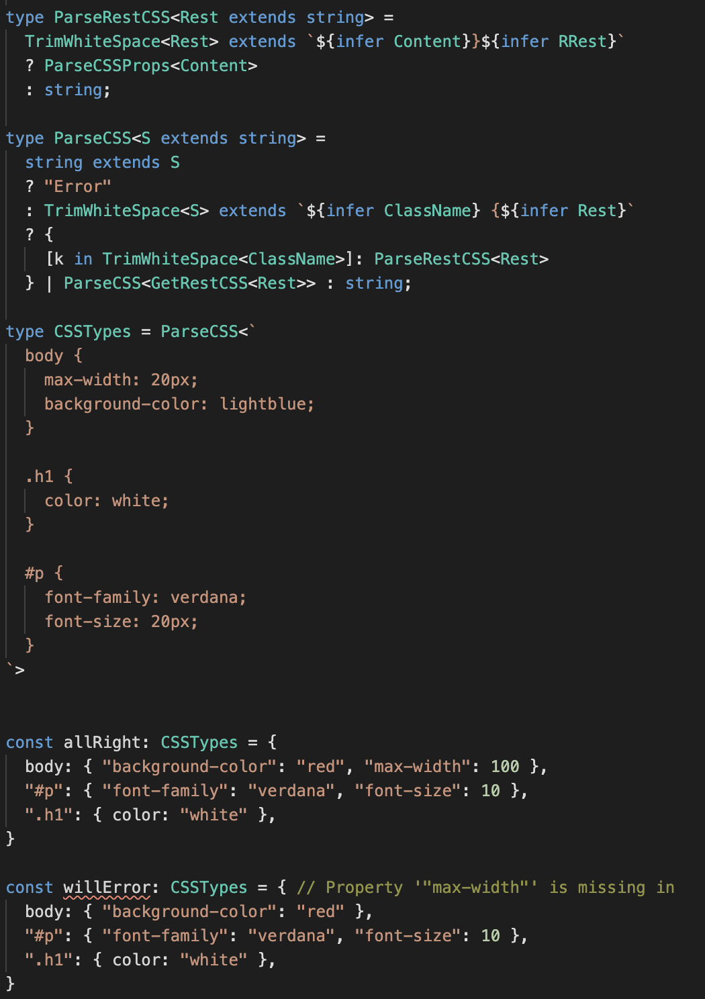

[Tweet](https://twitter.com/anuraghazru/status/1310634306092462080)

[Example](https://www.typescriptlang.org/play#code/C4TwDgpgBAKgTgSwLYHUAWDgQMpgIYDGEAPNsHFBAB5YB2AJgM5SPkK0DmAfFALxQAoKCzadKNCA2Zk4QqAH4oAIgCicOAHs4SuQC4oM8XSZQABlAAkAb3YAzCBRkBfcwB8zAHVrW7Dg+Rc5RXhkdEwcfCJSch49f1kBUEgoAHEIYBhwEkNqY2ZWRE4efjkC9g4jSRMZIOU1TW04nIkpMx9aewoANTwAGwBXCCcwKlNa2n6kACM-OLLOAG4BRKyoAAU8OEYIAGFsbDXNMEZSStb57j5BYWwzk1N2zvWjp11Hvx6BoYX3igAlCCsQLCYSKKxyEFQADaAGsoOxYIhUBgsLhCCRDhowFwALr6NIZLLEELI8JoqKfQZcLgQqBOKAAMnWm22ewORxOANYNMh+n6tBhtA0AHdaMsVskCVzgGziNK7vlRJcSsISWFUZESNKeLkqswHjYOn4dhpaHRgE4nL8oH9pS5rgobfK4tKlhLoBsthBpbL5brzkrinI1SiIui5YDgDqWvdrSazZILVbDU9bZHgY7Paz9pjjsR4+aeVB9Bc3UkPSzdvtTv6TBcg8ILgqDLVVOotDphPoQ2TNaRo3k2injb08IxGAA5PBIIZQKzWu3mWrgyGw+G0RGhUPkkg7Ufjqcz3H6LPeyO+yNF+nuU+yqXn6vanglpVl1ZszKQZj8W-VsbCKYNHoEA5wdYQkDwKgAFphQQehgDQfQACYAAYRiWSEpkIGEOE0fl6CgggNF6LR9F6BAODQYApi+DC6WWYQADo0AARjnWkiJIuB9GFUM6KcBioAAYjAdjIVsU1gCg2xpwQXoQH0AA3Bx6DwWg8Do4QJLNKDGAQAAvCBkLQqh+IEUwaWWIjaFYKA+l6P4KKo-QPyyb8xKgQDgP0KxlCwggcLwhhCOIjt9CUOAIHoJQABplAg6DYPgtAlH0FiUJQukYrkJQRNS0ClG0qSZKQOSQHypRlLgVT1Ni5Qit0gyIHy9Kspy5iWPy3zONI5RePCJQ2oEgRrNs2Del6epetcr8rl8gB6ebnixBxQCgAByJQEpguCEKUdb4WYUrx3Kdc5C8hSCv8wKNHwkKuIqyLora4RcrALr6sk6TZPkiqqpqvA6sKr69MMlrMqcbLXo6j6eu4vrQ0GyGBCcIA)

### ELIZA Bot

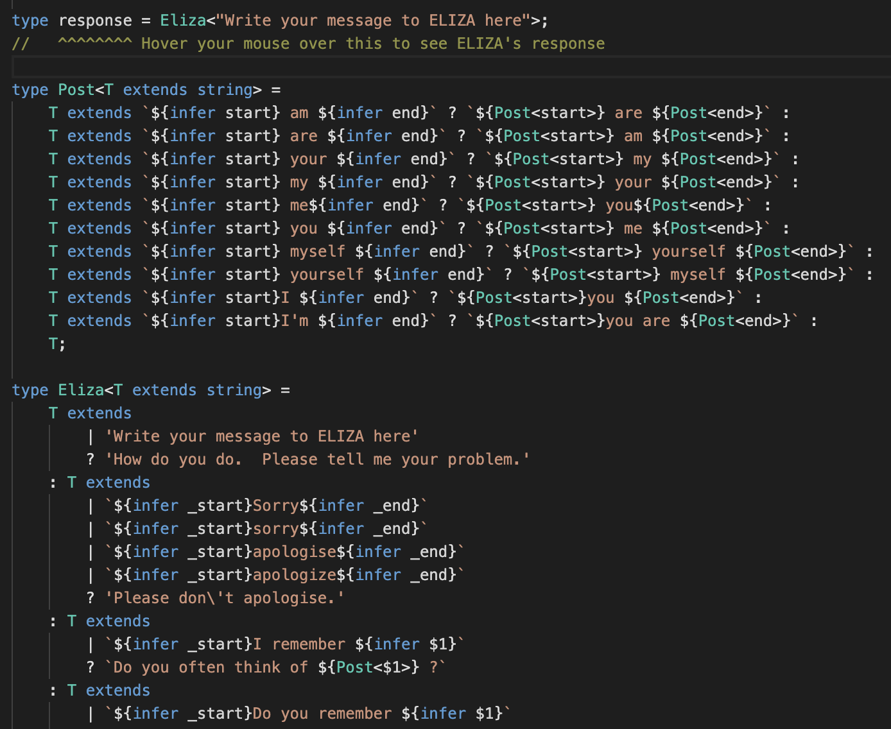

[Tweet](https://twitter.com/mrjacobbloom/status/1310530442177568768)

[Example](https://www.typescriptlang.org/play#code/PQKgsAUABCUKIBkCSAtAgpG9nqgSwGcoBDKAvAWwAcAbAUygGMALYgFwCMB7NqAEzoA3OjS5U6ffADsobZgwCMATgBsABiJz2JRmyI08AawakASlwDmdAE55iMqgQCeLHvOvEqhNplgAVZkJ8InsSNjY6al42LigqLmted2kY2XkoPydxAGVGWyporIZnAgiKADooACEnNPYAGigkKAo6UOIaGiguADM0ul8oUQs8RigehLSglnZuXjoAD28iPBk5BgAiNiKCDbI8AW6+zJy8vAKSKUkg60iuYUkAd3kZJy4AV0HGLmo8enxorEAFLEQTEXL5NiVAJBILxAjkDj-Dh0RjEd4EBgnOgQ868W6MOhSNg0WrEPgCSTCay1DjEciMQYEd5UeKJcaTKjEazkKQWMhsWx8oZ4CIeLrbcREAAUmIYzHCjgAXMBgCM5O8OOVvhRgBRRtYuARemxgNjcQVgFR3p1gAAWNQAZkdKgAlINBjUoCDvhxqqIflAAAIUawAK2IvqRXB+gwACoaoiErlBbgR4lJMSE+J4IpIeomoO46Eqi4qCCq1aLmJrtT9gN8BPY2KMuAJgCI8AAvYjAaMcPX0sXAHNsXudnvlAhnAq+YCQSCShhpjOYqAAXngBh7AB4NgB1WwRKBvd7WFp0BHEKyyWKIVBoIs2OgbAB8AG5IKqoD+AHr-gD-ygAAJe4bBPD5zwoD41zA885CCVI5WwB8AHIiBXLhMwGCAF1w-C8KXKA4yNNgdz8KBFgiK4iFKIULFfDdMB-DJKIWai+CIAADAASABvVYenA0puTYABfEgKCgfjBPAok+DErioAAfigXi+JI0odxExJXwk7kGH4zSyPkvSlKVZifwoqj5O4mSpCE88dPEkhbmkgSHLkq5FJUtSjNI7Sx10-SpP8rTTJ8izoBY6z2NsvyPMcgVRIk09z3spL5J81T1OMwLRL0lpajCkyrjMqAopY1ibJohLZKcoKXIoYrEq8hSlJykr8uCiCz3cvKIvMyzqri2r1Pq5LEgk1oMra7KEry5zCtPLrBoq4bYo4uzWoalLevciaso6haAqW6bDI0gK1sqmK2K2urPN2qaisxGg+lm88jt83LTsa5bINe97LvCsrIo2u74vGx7JpctLAYO6Gvs64GyLOl6RCBgbQaG6KrIhsaPphsTmkJpGTq0s7T36q7sfW3GRvuqGkuc4nUNCnbKO846fopv6xKpgzqZBvhypuqzP3woi4G3YhyPxziBXoxj13BmrOOGqqAB8oFQw9RQYNKLyvG9UnvXBi1QjWWNU1DQMefhYipvguEqYj6HpBgIk6C9evPKhDSRSJykt+nS022yrZ-bWmfAgB9FnsgSGlCdjo7I6gaOU5Z41rGTjnU659PM-zlnPC4YZCDoFO0-prWHqS+PGrEsuK67Kv85rqqqptuN3bXZ2pAAHVQ3gW8sSvg+GsP5YIIv67jlnmluVoKBRdKOZ4hRFPTnKABFHY+I5qKmKRDCOIWyM3wrlK4qeGYj2uWOLibG5S-f9uXyI14RpLN+3x+o7z3PK-KazsP6RC-uBQmf9b4AO+rvA4+0EKnyaFAR4HwaD5gSFYXgXUr4SRvnfcONE54x2AYvIGE0YGkKzk3PAlDobULgXvA+7wT5n1FMPfQRgRC1C0LglGO58EqVgVVaeatZ5wOftDEB4lmh8FuMQVokhoFb1EV3H8OVTBtE6E4RoeCFDX3UT+cRo11ZSKAVAWRYkFFtAoNXQuzCdb7lYLwZ2l46huMUVJZkFgrClFvPtZSIcxH3xIRYshViWbiGsKwRwDj2o7x1gATUPgPYevA5RSQAI7vH1kwGwY5ViT1DmE8xGjAGROsVIJR7cX6dwqTbZoSioBSB4CkZ8pQJDSFabUggJTQnEPKRU6RDcWYCHeHoFgCT-4VIzpY6xu86CTOnMwGZxiu6jIXk3As9g0SEHWTQkuTcABiHgpD7IIIciJtCUqig6HYNp1y5lbPIU3JAY4DD2C4M8kZCyWaXi5G0mgvyNGvKiU3OA6Zvkgo7o4uZTSyDiGIGfLCpJ4B8gMAQZgAyWKmK2kcl+LNgIiFEKCzZ-ym7yE6D8uFiSnG2y4PbMBTsXY-l7m0NcIljyG39lwQOFQQl4rKZIl5lKUoAGEfjWjFOSuuVSWY6hlTYOV1sdbvyVZMmwRB0G51qFTYJRCZ6EpkYvfgl48BuVUbMv5Cr3loObD-KBaiTVjPtVIOg3TrUbO7mpFx2h0E2muLwVooRUhU3oftCw7SDFGKNRI112yUrNPsfnfUCkCDklVZonWKayBJz4bEeQ3JPH7UFpmvguKTEisTW85NkkU7prEu8KQcSqBOGzb5VCeac40kCcW+Criy1uRbW2pwVaKo1pucc+tSjG0HBsXQf2l5MR8E7YilpvbC1PhLfw4dDABDLoRBICd+KH5irtbO1NL8m0MkMOu3Nkl816v7W0Qd2gBZuTvaeqdF7blTRTfOhSY6H2MvtqwYQqDqXiEkFTVIKIiyeHbSpIV1ahmittf+uRDa00LpEOwCQoG7aIcg80aD3S4OxAQ-hvMKH41mIw2C8VAGcM3oXRYGgWa6U2o0TbYjEGGBkZEDBpBVGGAcfJHR0p6Ha0QqvUBsSKJwgqu4z6tVYGSOCafDQETlGoAIaU2KKTgzjXTqJfalEBghB1JkU2pAnbwXWOaEJEQCn7Oqdk059hbmHPMew48QgazcMKXc-U+FjT1WsNTDo9FyCz7GmM8KmTZnTX2rRFINpAiqEupS26+t6WR5OvSjlhFaliMssPnF0tVMCsCLysIwh0nTN-pnSxgehXvVJK4vvKQhWqaKN0RfIRhiCEbLPeElr5mUpgOc562FYX6WTdS2-WIs3XMeYZX4UlPtoJuWINwSZZB3gsHGHN1YFh+mocnclpbeWWPWt6g+ricYbBxJWK8SC4xmz0jwB4x4F16sjcopGZg3R1jWHKGN39mHWviU-RdbLPGKWXqmqkthgtOtOK4v6kNKKPFwcCCgvNsbRv0YJblpNqPD4PZmht27lO4fU43lvC8T2XG1Aq2wqrJNBHCINVDm7MOpuo8vL5lHcPRd04i6hNHZBPVSXgwwXJ+T4SijwMIH9gumPi7EgAOVpQtpH8qsNiSeVL3jOs0BuSppmpw53WmxDDBiQE+mGAeosOwdXdBDVNYTRTutU1mpff1KSMXJuACytQehKL+B283yOTdB+guDsPsOxKR5aG4FThu1OVMT7UaC16ZENO1xHgvPxU-C-EkH6PKf4-G7Txn2v7hK-LcDxzrjOfPMswzzmNd9en5+bEkH8gXTrCt7u+JDPo-ZUD7z2noPHBDR167-7uTU0M9L6z+Puf8yddB4C0JCfDP0+1EPzZhuJeE8L9qDWAgdIrjH4D1P2-GIH-99X-T5-w-agsD+LYqQJ-dfF-JgQITBW4QA3fRzFmIPP-TBIA6xDPOAj-YvcLC3VCLbb2VoTPPbA7XgQ2aPEPcdK7cbYZUvG-IraSErIXNvEAzHUrLiNHdeQHONX3BjbvJudLfaegmgyfMSCVUIKmHgi3Rgw+SzX7UjJgUIEnB2XrfAw+RrEzP3L-YAsSLgnnRHXPPfE3AQmQDQxhagkQlxOgcHboc8TLfaLgmQw9eKLCfaXbT2VgGQVoSHMnc9Xgk-HHBAlmZ4dgUDdnB2MtAgM+H3JQ9gtfaxKoVEdETEbwpuFENEDEC-OOK-X1btTQIddYaLDobI40GQUIpLZrDw7-Z4DnLCPrJnTQqAb8BMflfbdFVYSMQkBEPAQORoaCSDfbMCKADYU8DYDglKAI9reQthYQruFhfacQ6zVBYYobBrAXIo8gqvMSUoqQuQ1BMYhvZYgI2rDY5nI3NVbrKLKrG3ZgDBSQBDeoz2WIGQxQlib8IMGIMBVYgAWkYmjVSF8J8DYPJxUOsWsxpCwgRwMIOPn2WLgGpDeA9UoKYT+IBUhO4D4Bak0IGKmghJsCcERORJBK0OgKbjaSxJhMMOv2WP10JM2MHx1zaSBKJNBO0LT31xpIpLBNoNN1iCZP2NxKH3126GhOZO+m0Q6D0TmKBzuLQ0WJJNZI6EeGICcCuSgKHzQBoBlLlNA10KQUJ1RT6FIHTFRHoVGDYiUVoAYAKPFOUOKNUIeWMDiJSiVJ4RtKmgQwMGtIVJ1yiJFBdM-wtOsRaWdOSOAVSMpJNzQCkj9IdPEiCDDNdJNyQG4U9NQMW29NLjcijK9KWNZKtwYFTITLpLxJShlLjP9KsUDJZL4P3HpA9KLILkTPTL4P60iFWEkGwN6HDLEll2XkbJ9hbN3yaRkC+IdVqFNOqOACgCVK6FWDFEvBbGFEwmwiIA9W6VSGjRIG4Eg3WExDcImyTPtRaX5JyljIBFd0SLXHhxFMKj3Rq1qUCWwLFOuwlK2KlKkn0N-mJIfL4JDL2JRKx3fipimMg1PNuIWPNNrJPyfVA3kSwgySgBbQEB5DHBTH4U13vKDLT0FiEM5NRPEkzO4IwqxwCLQsPgnM6Vo1WDQXkFMOJ15yB0mAsNvNIMY0lL4NcmBJfLpL3kQQJ1WDPnWALzwAsAVAd14AQ0As3LIMYpP0Nn5LzKpz6j3L9WYDJGt0Pm+AuRsA9UkDgiKjPNJx+PcJApKIrOfOdVzKH3LKICMuKzYvku0EjSpn+ytSotYLCN+O3PrQLP8OfHAQ6HRSHPoswpWIrPQqqO-H7PcQyKCFDSkGUlUjQHex6KyJ6EtQCWQX5GaDkA+H4t4F6AdSID6OUn8rMpwq-IYP3HOP2j9MCT-K0wLO0pEVEoYrfJPzR1bJWmjLT2aCqoU1arTPEu-zW3m1swXW6pzK5J1zSs1K6o+FbOaAC2xUmveA8rQU8r4EIEYAxF5H5CpheJeMEovCQuAt6tUNCxGq61l1tyGz8CcuFW7WHikgsOZDcmaBgu1Xgtg0Ph6BtFJGDgliAA)

### Typescript Type System Adventure - by Rick Love

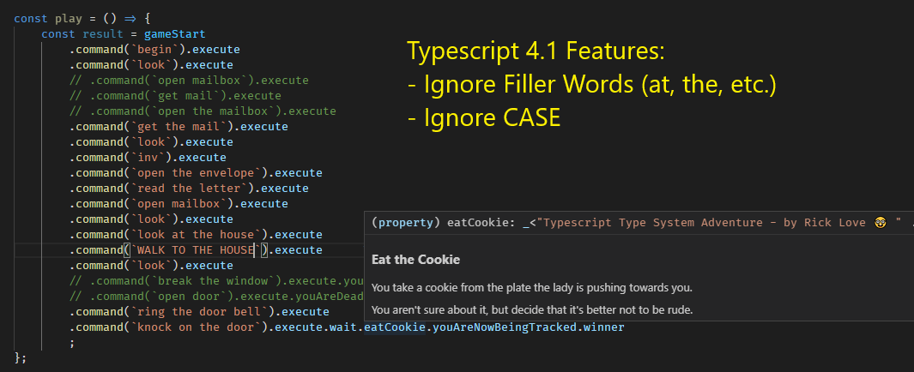

[Blog](https://ricklove.me/typescript-type-system-adventure)

[Tweet](https://twitter.com/RickLoveToldMe/status/1320875032197894144?s=20)

[GitHub](https://github.com/ricklove/rick-love-master/tree/master/code/typescript-type-system-adventure)

### Printf/Log

Similar to Idris' type-safe dependently-typed printf, but in TypeScript, working with console.log.

[GitHub](https://gist.github.com/joaomilho/d31a4557f1b850ec7e65730a4316c80b)

[Example](https://www.typescriptlang.org/play#code/C4TwDgpgBAYglhANgEwCrggHnk5A+KAXigCgooByAZwqggA9gIA7ZK2BFKAfiiuABOcZgHMoALjKUAZrQZNW7HF17MArgFsARhAESpFOHMYs2HXDyjrtu-eQrJjCs8uSXrOvZPsB7J6aVON14ACVQAWQAZAFFECA0WYDtKAHl-RXMVKB8tACsIAGMk70oC9Jcgy34hUWTmCAA3XQBuEhJQSChoxgEAQyLXKkxUAkIpclQ6EwyAAwASAG9haVsAfQBfAFJF5dtXdZ3mFb0AJXWZywBtV3RIbCC8ABooADo37sF+4EHME7wAXWSEymznY8yWRzWW0Ox0yyHOVxuGHuuABQKgl3+rRI0jUzCKcB8zCgiB8ImwGiS8gCfEEwhEeAAFFJpJTxLBKY8pG8Xr0BCIqOyPn0BkEhjBKXgSABKdkNHxwNwLcZQApEqg+OIvUkiRms4DPHl8gXS1rrbE6xkAIgAysA1NJpOzNuxNtIoJsUlbnhQQkhSRRngBGABMAGZngtsgBrdmCNTQdamkhAA)

### Bitwise Arithmetic

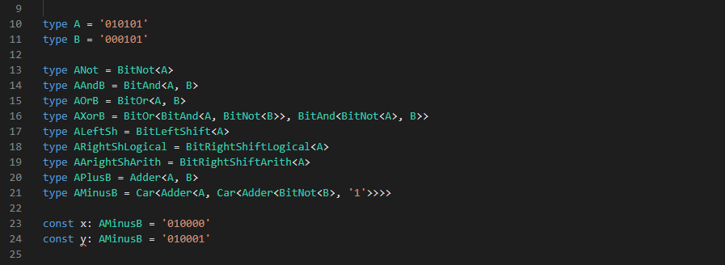

[Example](https://www.typescriptlang.org/play#code/PQKhFgCgAIWghAlgOwIYCcCe0DOAXdFAc2lWQBNoAjRPAd0RwFNTC8ALAWyb0QGNoTZL3RMANthTQAKpgAOTAMp9CcvAHIc0PPJY5M+JpyixoACgYdtRuWNR49BYtt04AlADoTcb9ABKTACOAK6IoloAbkzoOIgA9sjQAHwAvNAALB4AjB4ADL6+ABJxUejQCdrsLDoKWnhxuEzVVdDhwWJ4OF4wIMBQUDUsAILQaeq5WRMT6gO6CKPQ47lTWTOQswrQQwBycXgLSHi7eAA8Q0kbw0MU8Ae01+RnADQIF5CDWwDy6Ldph9-PV6XLYADTiPzueABhwegMOxxO8CSSReMIoiNoCPOqORwKGABkmAAzPCKdiQwkksmIElnN4fIZ+RBEdik9j4uJEfioMSQpkstk0vAcrl8Hl0vFDQgCslS2jkv60fms6kkuUcCXvOZDAAKYmCOF+W3I5GicPp2oAsigDUaAMIYM4ms1DF4O9BO00e+F7REoxarZG49Yh0DQACSlp1+IAopaY9tpENpOHPttYH0Qx8AqVmCdFElRiZoIpBAAPBwULTqdTQAD8xegizWTYAXCXy5XyFoAAYAEgA3igidES7kAL6D4ejxQ4cc9+uN6D9gc56J52dJScDxQTnvF9vIJilfpazbuk74wspYv4ztCbvQADa07K+NyLw8X+gr+gAH0AF1FxgJtoHfA8wPvKtlynZARzfCdYPg-952A0CwPyEDD2PaJTw+JA0CwAARZlaAWcZawAHwDNZgR9U5tmCThr2LRjOCgx8azQ0CawgtiOOrXJawbECm3UVY+KYgSaO4sShMk9imArB9eyQ0c2L-RChzg9SmL-OcFxE9CNNyaSCIwTASK5fYjPQmCB3ok4TK3QdHI0nAt33UToGwk8sOgI8-Lo+50TYrIXjYgAmFiQLC6SuNspsooUyL4uEpcwogp8woipjIqApSuy0Mwnwol4KKA6jSqE8rVkq59xPUcqhIAtxZMWeT-OypjwugKKCuU6DStWWr1CAxKaKynK+rygaiufFdfzCzTtyWnr9PnF5Fp0soopWtTdryjae3Gpdus4LJNNyzhIs0uaVOfcziNIvBURQCyrNoU7vKbFc0UeZaPxmm7NJchyQoB9acGu26PPnJdfNw-zAqR4KoQ9aaopipKerS9rkv8qK8YmzKusx2bpOqpqOrG9qKKmnqYfu6CSrKmj6uG6mKugKrGtG1q6YksnGeB-LKe25DAdWnbgcugytoO0X9u0yWjoM770POy6gb23JmcfJ8nssl63sI43rI1uy-toAFAZh0Ht3+DGoftuGvPQxH0AglGvazOZDkpQVaTY7HgeJpdeMJqTCoeiXRz-aXVc4Y72pXdzx1yd2fICnDfbR5Ug7wQpxAUZ3mKLWLo8GziqIQd7nusumW2z-iY+guPDuTrS1uTgz8b00y28fI3PpspdfsHEzHaVZkVXYIVi7EUunL0t2EZzvy2w31GzxYQ4C9VYVOW5MQV-Lm9K8U6vq3S7zI63ntclcmeZXnklF+XkP4b9zZ99nwv1TsDPqHVu19mxNwgheEOZl67mzIhNFcUCmJgz-q-BeJczRfyzp7PCcxCg8iJEMZ0HpXSvArk2J8pD4D6y0FTZqtMJp0JpgBLKVCaHmCYY1DmfNmFtUYTwiqrDUTsM5vzdqnC6re1zrgzYRCvT4loHgMQTAYwUEQGQM+vUopugwFgciNV-BMBwO0fYQ8tD4EIMgEgYx1AgNxmY8BJM8rhx+s+AIxiOg6PQFgFh3l2xEwcR3JW3cZZ7T7hNJs+CxCEOIWfW6QN3RYELA4l8MtFBMUOC8JahVEmYEtnZEsGSyIOIsc4CJdk5HRAUXgJRKi1EaJrK7CKOTdGYAVquIxJjtzpM4IcecbwClbx9uPbOwy-Hb19lvAJYCEpLkqegaptTVHkHUcgOJ11eq5JeO4kxAzs5ayZuLRWUtjlQ02vZHu8TE66RBurdqUSYlek0VdYJySwGpOQj0zJP5QktO8Xk9qTZcnxSEoC0CXzilgJHi9MF6F5mLOUcs1ZzzoZK1RdsP5WB2k7I6N0opeB+kjKGdI1x7ZgUOMarCwpvTIXzQolSps8LFGIvqWs5a6K1bNIrFs+yOKCVZB7Hsgp7YIWmJmasBlxp5HMrqSsjR7Kmk0WxZ03FmchV2RwaSiZ68xnEqCrvKVLppKlKsaiY1TgrGhyZTUllcq1lrhiEwOk2zc55iRG8+aHzRx8qyTLXJ+TDG5idXyj1D1fwBB5Hy+sz4RkRrED66AA4iXQDFP8slrSnjJpKNEIkYg4h0EUMyI85ARVFqYOQT4pRc35rtFUPgABrM0F5sTQAvEiLxJw40hpRFmqtea6AAFVkCxCIMW9sQ6R3FsrTm-ttamANqba09VTZxxLiApqvVO8PiFtHeW6d6Bq10DnQukhqJtmh0oWe-w7DWYGLZlwnmDURpKt4e1AgwQmAQSJDyZgMiWATrLRWvtNa62No9Lk0O5LxW33Qu+z9-lv1iF-ZAIAA)

[GitHub](https://gist.github.com/cleoold/c278c1689b41a25ce1417eb4c07877f4#file-bitstring-ts)

### tRPC

TypeScript toolkit for building end-to-end type-safe APIs

The client above is not importing any code from the server, only it's type declarations.

[GitHub](https://github.com/trpc/trpc)

### Split

Split a string value with a given sepatator

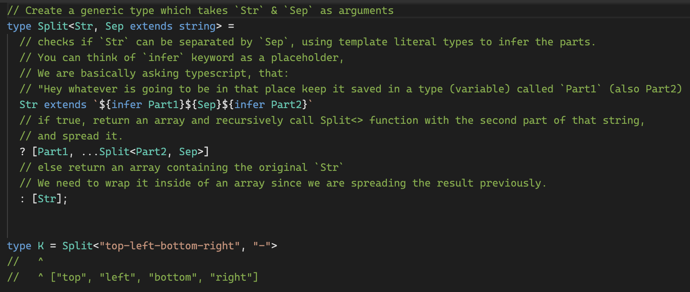

[Tweet](https://twitter.com/anuraghazru/status/1381685555465920512)

[Example](https://www.typescriptlang.org/play#code/PTAEGECcFMEMBdqlqA5tAdtSBLAxqPAJ4AOSA7gBb6WGwDW0AzqAAYDK8kroAZG+2gkesFrEioArgFtM8JgChiZUOxIAbHPAA8nSABpVQ0NAAeiDABMWTLjgyoAfKAC8C0KBCg8laHnosOABmAlw8eLAYoABGSExC4gjQljFEAkKshpJM9qiE0NIaSaCaiJCw6oSkzIQA9qD2QdiEvqAk4vIAdO6eYACatZLekS329KC1IayN2DyMROS1kCmiyG3qsHjQlLXqltj6PV4A6kjiSNGi+BXqaaL0uVVkTHi4JPCG8JQIAFxHYAAiAAS0DSVCSADdmjgWKhao94PVYg0ol8EOtNkhGMYtKAmLAoSl7GtlEgABQQ8Q4WDRdTQACUw3UdJSrAACh0AIw8MkVJj1DmQeAAJnpPT0JnMmGsbAAJABvGaQUCC+CcgC+CsEJE1iowTWVquF6tY-waIS4kmghhg8EkkCiI3E5TuVlAMDw9pyUNuTMqalK2mcQUkGDw8BwtSi5C0tC+cT8UZS7SFEwt33geLsDkOHi8kRSTBIMFgRPg3Q8AH5QABtVWcwydJsBrTaI2GbWOAC6oDN0HU8Xd0DtDuQjsgLu8UfgsHsCNaSxwqHsFVC3F7ebAp1AWGSdVA5HKJAamfsOX2abHyAnsDSOTDFDOMDxxbglnnSBgTEk6kzr4hkbZLcFagD8tZ6F2ADcCgwaSoAANKuKoGitgCiIkAAtHSQTwBh0S1PAiLSBhuCoJQ8AAoYAIYQCjgKF4HgAHr0WATG1mhtQkJRoAAthFFUfhhG1NI3EAqR5EAl2MH0QAVDBABCaQAIIYPasB5ECsAAF7lAoGFoLGkjRGB5HwCQPwgMuXxGZ0eDCcAkRqWR2m6fp8AxoR2AmYRJBMBZwDuVoZS2fZjnlM5OmSDBAAycCjtISxnPhkiZgAKuwoAACydJyoCpQURSIKA0VaNgq6pdUiimb5-nkHVnSki8bzwBsDidEsqDAJYtR4EwwDfFY+G1PQwDCgFBUbIgWGleU6gYY1nTkdI6gwTJwBAA)

### Privatized

Automaticly privatize methods prefixed by '\_'

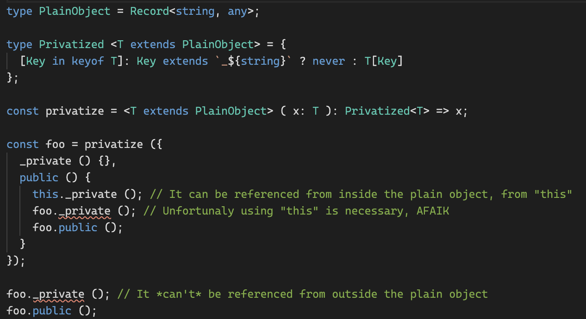

[Tweet](https://twitter.com/fabiospampinato/status/1388187928925442050)

[Example](https://www.typescriptlang.org/play?#code/FAFwngDgpgBACgGwIYEsB2B5ARgKygYxBgF4YAlAgewCcATAHgGcRr0BzAGhiTTAD4A3MFCRYcVgDckIFAC8otGPQAqMKAA8QUNLUbxk6bHkJ8SMAN7AYMANoBpKGBjoYAa0eUAZjGUBdAFwwDk4aWjp6AAYA+gAk5sysaGwAvhEwAPwwaFASUNQwgcr2jr7AyULA+JRozDAQktJysKQqaprauvqomLgEIKYAFDDqhTAAlIHiKFIy8gzKpsSm6hVVNUSelJRm9dON8jADltZRuzOwA2MWyRxWdQCuWAgo+IdXx9YwIAAWKIwAdKcGlo3gIYAB6cEwACSRHwPBgWFg1Cgnjy2nwChgnmolAAts4aihaLAfrAIAY0DBKL1CFwcfiYAAiH5-Jl3aybSiAs7SC5jMGQmAAVTQm2oIHuaCQCCc90Y7GZrMYTOcemymMYjCQ1DAXAAggAxfXQuwc7Fbf4QR7PV6XITWZJlAXCLk84H8wVQ2EwABU8LQAHIQL7EcjUei0JjFAyCZR7iAFSSvt9yZTqbSQMA3dani9QcJC0Xi0A)

### Join

Type safe `ReadonlyArray<string>.join`

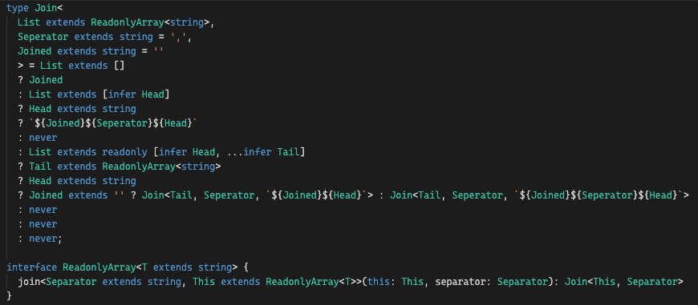

[Tweet](https://twitter.com/ghoullier/status/1390331553394331648)

[Example](https://www.typescriptlang.org/play#code/C4TwDgpgBAUg9gSwHYB4BQUoBkEGdhQQAewESAJrlAEoQCG5cSANiAIIBOHdIK+HyAOYA+ADQYoAZQiRuwOB0IkylKPyFQAvFADkovRPjII5JaQpV1SQVt06Jw2znxmVVANoBdCQH5YiJBMJAC5sPAJic1V3ZAAzCEUACXpyb0w-ZIZXCzVgAWtfKAADABIAbyNA8gBfculZOnkOWrLMmqKQqECANwTO5wjlHI4UplYoGKR4pJTRKAA6RbiEqAAVOgRmNKg-dc3s1VoGMfYuHj48oWFCtoPLS4L0-2NTSLc7HefUPeY5+oTGgo5qUKgETC02tUio5QpUUD8-jIAU1geVKuC6ki5AoISkoddMKEen1CV0IL0OJ1iRwANxoNDIUgcWJ0ADG0COjBYp24vFWd1y+REUDKEgAVgEUPU6NjFG8clZBHNVgALPACzknTi8+HCYQACmAatwoVVeDmuBkMsBHFC0tlAEpYZKzbhEWBrU1rtV6aymC5mOFbO4dEwIHpdMAAO5wCM6I0jcOeKB0Kh+pD4OlodMuCUvWyB-DzPNIfV6HQOtBAA)

### Extract all paths from object

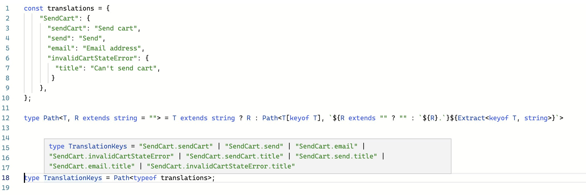

[Tweet](https://twitter.com/wcandillon/status/1409503819575275531)

[Example](https://www.typescriptlang.org/play?#code/MYewdgzgLgBFBOBDSAbRUCW4IwLwwG8AoGUmAZQFMwATAYUXigC5CSyOJr7GWYAiKrRjBe-ADTsOpLrVaDuEqdMoBbRBhTyAous0xENGvEoQIS6WQxgAbohQYeTclHSVt8eCHitily5hQKJTygcH8yhwAvsoxMURQAJ4ADpQwAAroABYAPAAqjADmlFDiGSYAZhgAHjCU1VDcONDw1oV4AvwAfB0F8MWw9Y20zQhtMAD85ZRVtayZULl9AwDaANaUiSAVMMslALplAAYAJATplTV1DU2dk3esp+eX1VEAdEdRZ9oNSMBQOQ2Wx2e1KMBabS6USOXSIcKSqV2SFQ6CwkAA0pscPgFrkEZRtnBkRA0JhsF0gA)

### Repeat

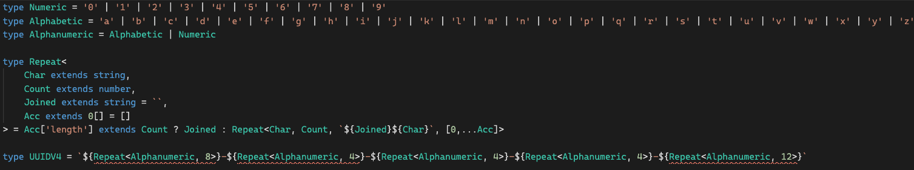

[Tweet](https://twitter.com/ghoullier/status/1408440499283935238)

[Example](https://www.typescriptlang.org/play?#code/C4TwDgpgBAcgrgWwgJwJYGMoF4oHIAMuUAPngIxGm4BMleAzHbgCxMCsTAbEwOxMAcTAJy4AUKEhQAggBswACwCGAIwjAM2PIqbKm6JgBMmEJgDMmAcybymqJgCsmAayYymCJgDsmAeyZgmAEcmZCYAZyZgJjgmADcmAHcmAA8mECYALzEJaFkFRU9EFA0cPKVVdUxSeCQ0dFFxcGgAJQhIRWAAHlEoXqgAYSVkKAhk4AhPAzCoMOA0TwsAGh6+-p84T2ARsYmpqEKEVWRlvqgAKR9UTwgDbfHJ6dn5i00AA1eTvql0TFH7vfwAG0ALqaEGiAB8mm+6EBuBkEwswBsoL+u2maw2WwA-OdLtdbgAuKCtdpdQaKY4DdabRZQV4AEgA3hcrjcAL7MinIdkfKCA-CLAB0IphwIhDRyUAAqtKAJIAEQAasw3szSRAOp0ygUinU6fwIeyALTqtqaro6g7FdB05hG01MjVaq16jB2h1msnauRKa36qD2k1ei0+-L+91QMjUI2vURAA)

### schummar-translate

Extract typed ICU params from translation strings

[GitHub](https://github.com/schummar/schummar-translate)

### kysely

A type-safe typescript SQL query builder

[GitHub](https://github.com/koskimas/kysely)

[WebSite](https://koskimas.github.io/kysely/)

### chicane

A simple and safe router for React and TypeScript, based on template literal types capabilities.

[GitHub](https://github.com/swan-io/chicane)

### Prefix Properties

[Tweet](https://twitter.com/ghoullier/status/1471531186749067264)

[Example](https://www.typescriptlang.org/play#code/C4TwDgpgBAqgdmAThAZgSwB4B4BQUoBqAhgDYCu0EGwEcAJgM5QPCJpwDmANHlAArJ0GKFRr0mLNpxwA+KAF5CpCiOq1GUAAYASAN4DUmAL572KCIigBlMiiFHNUAPzXbQqAC4ocCADcLOKCQUABiaCQ0iADSECAMuPhWAPZkiADGlGriUABKEGlJiHRYkuzcUGRwANZwSQDucDI8+GERAXKKVbFJKNYp6ZliGq2RzlBdID19qRme3n4BQdAGQgJJkIjAaBDxvCuYqkMSrGXN0wOH6kx5BUUlJ5xcFdW1DU17gpgQdDFxl9mlTgKLR6fYYEy6EYWX7xZIzCBPQEcGQOWTA3S8ADaaw2oCg7H4nww3xhAF0vHCBpj4EhDNgcRZQE8wTJSTgjDhAuBlkTvsCwQzNtt4gByWlCAD6IqeuigKEQSQAtl4ACJEGhPYBJVXqhFQABGRAYEC8cDIiv1FiecCIipNzAeHCgRhkOAA9G78AA9JxAA)

### Typelevel Parser

TypeLevel DSL Parser

[GitHub](https://github.com/anuraghazra/typelevel-parser)

[Example](https://www.typescriptlang.org/play#code/PTAEBUE8AcFMBlYDdYBtQBEDK9QAUBDAJwGdYjQAjSUAFwHcBLW28gOgGMB7AW2AIB2AVyIEA5gAsCALyJCAsACgQoAOLMAEkMoAuUBJbQSOkGOYTtnXv2GjJM0cFow0yNAFpoxMkSUq-YBgAogCyAPJKznCgAEpCAgA8YZQAVgA0EKCwAB6sAgAmJKAktESMAmIAfKAAvKAAkgKsRNBEsLQJSqCgyeld+N7kCeBcANawAozSsMOgAGTFpeVVlUqVANxKkS6YsDxcAIy1sfEJUbBcAGagXKkZAETcPDwTtCQA2gAMALr3G9vRDB7LgAJmOcUS5yuNzuoEevBeTQ+v3+inOu32AGZwacoddbuk4U9EW93t82AASegSciwAAUjHyOkxAEo-ps0TsgfsACw4yEuaEEh7E17IthCHzsgGwDFcACs-LOgvxsPhzzFZIlPjYAgIL2lnMBwIAbEq8TDCeqSeLJexUFwzAJDejuVwAOzmlWWh4CWAlWD5NiuG1sehcIijNi0LhcNj5Ai0Ahkl1c4EADi9cCFap4jGyga+5ITSaL7wOKI5ruBAE4sxdVVa8wX8kX44nk+Ty5WtspAsCbtcSJAmgRslkiEQIyQZXLGkgCKhGRguLQjnUIcrs42HgQ2Knjft54vl6uwRvcd7hXD96jq0eBAul-kV7RsReBdufTfb1W0w+n0ZABBScCEgdcTk-Btv3uZMD1lN1j2fEDREgPkPy3aDr1goseyNBDgSQxkAHUaTaCDNwtbC9ypMjYHguUADl-VYfIgknadz0gzCcytPdKC1PD7y4ZiAzYjjSHfbiqLVfjOHjNhf17bgBBKS1jgAb36UUkT0d5+m6LTFG6EzQEZPQDjSAyTJUvJaD0e4NDQB1QHDIhUHye4rOM0zQDtIg9A00A9ReBygNscRQA0BwCC80AHSdBzBBEcQpFkWLQAAX280zsusozfLMplQBBHLfNs14HPACRGCKWrQB02gvOs7p-MC4L9VgMKIrEKKYrihLyiSnq0tEe4srK7o8p8wyWqKvRMUmmyuCaSq4SgOAsA4MpoFoMyigIeh-V4WAAEJmpmky2tAIKQq6uEACkuAkARMC4eiMkGgQHJSZ6Cne8bptysrvjKv0xMC6yQzFSHLu6NzRlhwruhjLh2pLAg9MskqMkxb4JrmoGTKJonm0DPT8rmjGKbhkz3nucHWNAYhUNAA44oZljA2Z0CaBBe5Qbm7p6cZ7mWbA0BMQ50X8h51meQFpbukFy6iZVzLmaKFSSg5AJQD1g2+31o3wDCABpIJGPqAAtIIYlnep8leRhLkYIZwGqOoCroFwHPqYJGPAe4OW6O69HADkNYWDTMt1xQcmgCM9vREZxgEDb-U0-o8CAmJLYAfSwcBc-AByc7zxjC+LmIg5D-Bc4Ly2MDLhvK6b4P+gAIRiICAGELfAKuS4c7u+4Hoea47nzR-7oJB6bkee9n+fGIwKfugwMJ4HgXP897neAFUsCCBzN+33f96Ao+gnXzAwlLuFN9r-p-cth-7lfwPb8Yg+Qk7u2HI-z-nbW+xENB2xPnCMBECp6x17AnJOPtoipwmCEAg0As4+XuHSe47VzjhzGBMDOHx7jlwLkXEuAssp13uGyPBvsICEPTi4EhZC26ryoXArB9N6FwAIWnYh9MZ7jwoZPfGXDugC1wTdJB90UHMLgCQ4Rc987t3EXXWitJeFyKYYI+40C86cJofubR-CiEsPpk-IxSguEIKIMnHY8jNKyL0OMSA0J5HEPWKAd42Q9AlDKBUb4ehBA0C4bOIIuRRAcFoI7Z2rshj9CAhwDgWRcgTEKIsQJYgyRlVTscJ65QEjJI4A8P4axjj5JyHkTJbiPFMLQdAfoAB+UAWAmC0A4BIeRwwxirB8vwtJNSih1OuIxIQPBKDkEaS0mR+C4RAP-jEYOoAnxCHuuMyZ0z0HvFTuI-oegSlDIyUUMksy-QoF8AMhoTsmguzdkQXpoxUSznacwLpPSPaVOOQUEZsB3HXHkY00ArSgU7PAPjcOccU5MKmLARozQ9SoE6D5eRRRqknKycsXJSSUk-MyQE7F+M6g4p8r3EQFA6hOQIPkJ5EwSCVDKjETOGLfnMwEJAMkxwzmKE9qAclk58WnO+LMo5rLMk8tMq05lM5Lp6UUmwGVGRImlAIDEuJdyEmPJKZUEV1yBUUHFX8gFjC04zJ8q0kp9NUATDELQCQVCjWgE+NZVpKgXbMxSRMoQqBEwRn2lkHgu0aD2omK5WUHBBCgBSJKPaYguCa2KMsG1dAmGysKvIuFCLyBIpRcjCABBGDIrRYyoWPiVb5upbS8Ahbi1psqKW2mwsFVKraR0j5TCEgGt1XNfppk9AqDQGQIZ0Tk40iKvEh5c1M3TGzUQXNZaa1FrpapRt+bSWVtgDS4YtaV0MrXcjd4Lb-TKqiWq2JtzaD3KGDqjIbzOndM7d2vVhU+2gDMZMWdq152Ljzb5Jdda04MqVj4hVJTT2qpiV2ilGRCUVF1SBqtO7l0loPaZGV1kXnx2yInexsjTUTDhbMJ1cGqiVNhV+xFv6sDQCXB0cAZSG3QscWMN0EEZ0zHuDSVADowwRg8tGGqJA2C1WjCw7ajBdpak0W0BkxhDrHReGyO8LHRhui4hxhI1pNTkhk-ScyrJDS9n8EbQ2JmVDl2PvbRQTsOC+raA1Faal2JTiIJ3UQBQ9DxEYAAR3WcUSAkyuCoA5HYhx0RCCkHIC5iMxH0lstI3y8A8wZH53zpQDzxULQxbc5l6hEScOwCg8lp1QV5mjIIwozO2UIA7BI0sCoyrUBkD5fpVFSh8ZOveBc8gL6QUDCi0QHLCQAAGB8-SFZidzDJg4zICGgEIWgp64BTdljGNOs30QUg0hnTKI233hyFX5AosBXZ+nyLMyLPhhtjYmytpmM3oTlAW0t0AkT7vc3W2G6EW2dsuD2wdiA9NziOvi5kjOsygjNdgAcgb12JKjfe0VpmX3Xo-Z2Nt3bGR417Ux8DlwAsAfMeiEERMcXhlzIYRVzxLCJq1eiPV7JfKkdQf6AxtnLgyqlHWRUp13OYcWogLDln9GMgZwyPzrD6J6gkB6WzsYR2ytU-+fUgRtOiY04Z2D41qvzGKIqXUVO+O4Cg4p5r2UrT+fvtAJcRcZBieymiiQHLJAEgADVFz+adfEUYAguD0AEE1lrxwPeoC99ruH0WEeJdmaHnn1yof297OiVQ7Q4-wsuIxLgV2o+ueGBkM2rXIl2aEE7fPoBC+dYj91twRA+uguF9kEvZeGMV6lzsHPjQnbZBKf6V3JWI+hLJK1-opP6NFgeMoweoig4HoVXSMfwxuwPEWSA6opWXELN-kswGrqfGL-AMvrfwDlmMre2Tw-IJQZwin6ojhPa5X74v0f+4t-266pZB1o77xyiXHIPgbGX-f-PAUqUABVIAigGVWgevNQNPT3DPLPHPIbBHOaJ3F3P9QqPAI4AAH3wDBFwKgInzLRAMV033uFX2WW8TWXuggIaBO3HEyjLW6FaSVz4ThBQjAl7xIBIBWXKG7z0C7xyG8S3XskliyiYOt1YPunuA4MgC4J4O8T4JyD0B6yIGEMTAWnENpjQxMikLCl5nkN30ukB1UId0j1IlpF7l9TtHJ0xSH2+BHx8gPwnygXAUMQPWcIrAeDYQnlnzKmcKvweE-j8NH2fzxm8NbjvzXn6Srwpx-wED-woCwIyFoJAJSISOAMWjm0SPwB5BgNT1oHT3qEz2z0GGQLz1QIIGdwkld2IJwLwNAFwLwGxCaJ5BA26GaNIPmQ-gDlrg6lCmyP-0Yk6i0PzWYMpzYP0ToisIIDtBWWoL0Bz16ASGGJeBS0S3UNEL5EYKbRMlMSgWmOsLIHmPgMCljiyA0NAG2N7RAz0IOMsKOPolGJMhMNrzjjC3wyQL-QHzNyYQ3VACAiLk0iJgFRIH9SdScSpS3WrQPXgFjFGCAhpBpSO0hKimhJBGGH6T5Rlx6VBIjAeAMRvnXwj350uzKOQ1QE7kgHLx5DPxzwsLaBmJsI9kBxxKfREDBKICCN6L+CO1JMFy+IAypPLwODP0BOS2jjII1SvS1ROLD3ujxKIBFk6k4VZNl3ZNIHxMfnvl5L5zkAF3GPeDhLGEROhNiMxRr0uT63GKQJu3GwTmR2mwKFm2e0WwyAdNWwaF6P22sj0GNIRKRNlg326OCPGlwP0TcJvmePGO9kKm6NfEMLrkKgWIBKLiTPKhqg8jaG+kj0eSFOpNb1FNREKh2P7VzJuxF0+yYU2x2GCOx1XFAG239NNJpWN3om+AB1hzZLTmg01K5JvyXhEWrlnz5P1LJKi0EJ7xST70xKO1tOjwayqD31jN8m6NkMTLLRTM73oPkMxPTNMiUL8Uj0nN3I9npkPIFn3JskzPyGzMWPJPzPL0xCY0Jl9JujLTXIMOnO4NvmTNONTIjjLUPPvInJ3O-P70qHPPoMvLLS6SLVvImBAp8ApOFNb2fOLN8lLOt27ImF7M5Mn0HJUXf1HPjxtLKOG3uHtMmxR2rLf3vy7PVJ7MVJX23zXxIoNP63nLz0oru0dLW2rIoPKWuXFLMKQLY2OEFIo042414zcgE3tVE1E3OBIAkyk102pFpDkx0AUzBKUz+BUwizKPUwkofKkq00anFD0wZCZEMxfMUGMzADM0ctMyNnqEDjtjwDznADtlnDwElAkGGxdyO3sIyHFL5XFLnPIoR1oKCDfVaSPUUhd2VT6z0m+HeJw0QWl2-VaHaD-V6CO2ZW4CIFpVCQyFCQPXFP8JqKO1Iy5RJT1XCqBKdS4tixisnDire0nFhwitKzmhDMvWvSIF-JMhTNoOlPTKwtaV6HeGlJSoAsVz6oYXuATPAuGu6FGoyIoHGrmjgqzMQsGIoF7hvOzImtmWlK6KWulMGrlPWT0DGsvVWNlCwvGLnRyo6GmulMeuvyOvguzIyD8pIACoRySv5WOomAbTfNeraHethB+r2sD3wH8sCpqIyDhoQoEAhuEqaojxXJRiWvXNWqvI2pyO2tpmAoOroO7yvN2vRrus2tBt+omFOsF3OuDMuoGtlKoP-PuteEeujP6yhtyo+oes6m+BmvoO+rBoRoBqBrzxBrRuzMxrLNZojxaseRj0ulaUFphpSHFu72v2lP+qRuBpRpuVeCVr2LoOaDeqSFSD1pyElsZuluNrltNulItsOWxop1xrIIZNgCZOOKJu5vpoADEi1mgqTmaXrsroaMCTIZdxtGAVoEgCiqSw60BaVegMgw7UAI7IAG12Ky1QUhBaMXZIBE7k7U7IB06PJbbCQc686LbCo9Aq6a7M7YQG7yAqSdDDIiZTIZbkbXMSBs7w6u787MNhdqqusYDehJ6h6zDU4ihDczLtMkRpMNLZMw5ko7BlM-xogIq6hJLRgGUzDtbyA3Rjhta-0VyLKaZCogpzI4QhBGR2ZvEw44Rt7xAVkKomgHIFK6oDpHMNQkRAZbj5on7GR+Y37OphoUoxBv6Vo7I-6dgbUUB0AvBBtQG5oH7ip7hn78gpZoGBj7gUgJAVoEHVpf64Q3gbcGAjDTI0r+giZxS1g44nLjZzNnKVAD5wB6h4AsAlAPj0QaM6M-0sBSgarFyyoRHmAqTJHskyoxUI9ariVy0Dc2kJGnV7h7hRUUlYdxHDUI8RtttUiDhMptsZHaAqTzGNJUiQQ9tZlLGEg0i2lS6rHIAMgEq2BwMACHDYcvGfGDHGH7LsNcNwtZQ8Ayg8wr0UBjhSNGjgoJkpkKBcDKBYwbUo1UnGAnRaBQsMq8N0RClEg2cjsfc-cA9-iMB5HlhFG8VGdlhjhtH1GfiLSYCmnrkWm2V3hInGBonGAUAYDjGNISkbHD8fgHGOnv8em+mUAMhwD6aD4YCimEgD4MgMAMghmRm8dxntsMBOzrlSN0qwn8NNlkngUvZ+h7hPhpFPgaF2YLIaF+Y9AQQaEpYFoaEFY9AeQaF5RpF5QaETRpETQaF3RpF3QaF0xpF0waEaxpEaw7nrmLJbnLmDh7m2YDg7mnm2YXmUW3m2ZMQ7nPm2ZvmUXfmLJ-mUXAWLJgWUXQWLJwWUXIWLJoWUXYWLJ4XLmQREWSpkXFBwlQnMqO8uBoBbC2Uyn-cBBh9vkut5mci8B0icj84IVLt-HgmhGdgkNOnMlxWKmHDpXq9aCNA5nFJaD848AYCNBVW8njn0Qq0MStWigdXJW9XDdv9+hDXLJ3X6aNBSp+hZX-8zWOtZkfXYdTDBH8nwmC0UNSmBBfcJWpXXWutTWjWwCTX6blXBdwArXw2bXHFa1hSSnvdY3ynnWyo5GnVhAtkuSkkjtK3km6q1HeVjhy2I8gJrVbV7UqFQVrdHyANMSMgqSjbAbik7L1WIt-LRXtXi343r83djhPhWsFVW83dgmc3BXogK704uA50yAYkk7EgD4+U6R+gD5gqOV+s6REZQAD4WRahqgkAuBGRrdVClBb2nVL26aSbb2ah73H2LsWbQ23jk8dh4AqjaAwhLhZy6hN2Rgd3kd93viz2aBWk6Rv3qhksVDa9ecI9UO72KbrNxiCPn2gOQmx3ZRwAS6lxLhy7Jhk62cypcA6hQOSgIP+3+hGJuUIVv9VD8ZLd9Trdbdod1GrcnUOP4rIVEbh2KPS7qPN2Ehi8w8W8Mh4AG1lOsMyOGgSA5OvkSUuOusYPt3v1d2r1k6PZeObc7dZQ9B+drX13ZRW63Za7W8ABFdZIgfO44FVUdcvSLK9X9Vz8gfO9TiNz4wYZY-oXoAx6pxrfoSxh7ZRxchtpxyL0oB4NIISvlAzuDvdujnyFc94M2ObVxujVibrJJ3rYJYr5gBIM2B4HQXUg1+m9ZimlduaFgiQ7porqphYUjSrudrR-nHR3YqVOgMc4by2-riPe4QT44iQ8YmbjisY63SbinCrU57ZJpcb8Y9bogRpd4Vrrb5bq8qaOaM4uuTKd4OLwsOtir1hpQIAA)

### Type-Trident

A curated list of advanced type level madness

[GitHub](https://github.com/anuraghazra/type-trident)

### HypeScript

A simplified implementation of TypeScript's type system written in TypeScript's own type system

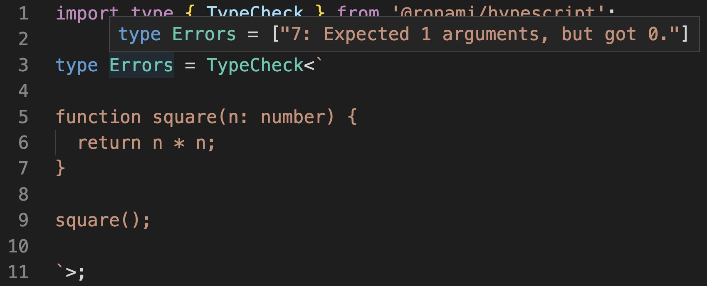

[GitHub](https://github.com/ronami/HypeScript)

[Tweet](https://twitter.com/ronenamiel/status/1552375586584133633)

### Anysort

Anysor，Flexible and Full Typed multi-properties sorter for nested objects

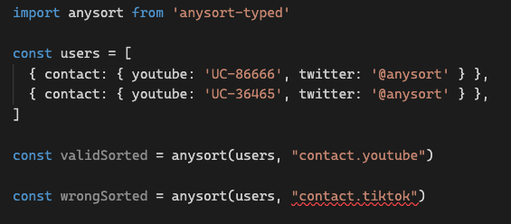

[GitHub](https://github.com/Lionad-Morotar/Anysort)

[Example](https://www.typescriptlang.org/play?#code/JYWwDg9gTgLgBAQwHYE8DO14DMoRHAcmXUwFoYUwBTAEwIFgAoJgYwiTXgFc0qo04AXjgBtJnDgBvOGyQwELGAC4pcFBC4wuAIyoqCAVQDCpABwA2S+YIAaODADuwGDD76AAsQywCcAL7+NuKqsvKKKtLqmjp6hMakAMzmACzmAKy29k4uboSeqN4wvgF+QYwAukys7JxwAG4IADbANADKmLRCiAWYABQ8fGh2AEShCjAAdFFausMAlFWMsrUOuEgA5u2wncJefQP8I2OKEzDAANYwEOfzTEA)